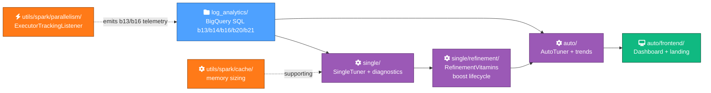

# Contributing to Spark Cluster Job Tuner

Thanks for considering a contribution. This doc gives you two paths into the codebase: a 5-minute Quickstart for your first PR, or a deeper Architecture orientation if you want to understand the design before writing code.

If you're not sure where to start, the [Roadmap](ROADMAP.md) lists Issues labelled `good first issue` — those are deliberately small and well-scoped.

---

## Quickstart — your first PR in 5 minutes

```bash
git clone https://github.com/albertols/spark-cluster-job-tuner.git
cd spark-cluster-job-tuner
./mvnw -B verify          # 27 ScalaTest suites, ~3 minutes
```

Tests green? Make a small change, then:

```bash
./mvnw spotless:apply scalafix:scalafix    # auto-format + auto-fix lints
./mvnw -B verify                           # confirm still green
git checkout -b my-fix
git add <files>
git commit -m "concise summary"
git push -u origin my-fix
gh pr create   # or open via the GitHub UI
```

CI runs four checks (`lint`, `test`, `coverage`, `Analyze (Java/Scala)`). All four green = ready for review.

---

## Architecture orientation

This is a navigational layer — read these in this order to build a mental model fast. Each `_*.md` is the source of truth for its area; this doc points you at them.

> 📐 **Mermaid style:** all diagrams in this repo follow [`docs/MERMAID_STYLE.md`](docs/MERMAID_STYLE.md). When adding a new diagram, copy the canonical `classDef` block from there and pick categories + icons from the vocabulary table. Don't invent new colours or icon styles ad hoc.



Read order:
1. [`README.md`](README.md) §"How it works" — telemetry → analysis → recommendation.
2. [`_LOG_ANALYTICS.md`](src/main/scala/com/db/serna/orchestration/cluster_tuning/log_analytics/_LOG_ANALYTICS.md) — what each `bNN.csv` carries.
3. [`_DESIGN.md`](src/main/scala/com/db/serna/orchestration/cluster_tuning/single/_DESIGN.md) — the SingleTuner pipeline (machine selection, executor topology, strategy threading).
4. [`_AUTO_TUNING.md`](src/main/scala/com/db/serna/orchestration/cluster_tuning/auto/_AUTO_TUNING.md) — multi-snapshot trends, statistical analysis, [`BoostMetadataCarrier`](/src/main/scala/com/db/serna/orchestration/cluster_tuning/auto/BoostMetadataCarrier.scala) mechanics.
5. [`_REFINEMENT.md`](src/main/scala/com/db/serna/orchestration/cluster_tuning/single/refinement/_REFINEMENT.md) — the boost lifecycle FSM (`New → Holding ⇄ ReBoost`) and how [`RefinementVitamin`](/src/main/scala/com/db/serna/orchestration/cluster_tuning/single/refinement/RefinementVitamins.scala)s compose.
6. [`_PARALLELISM.md`](src/main/scala/com/db/serna/utils/spark/parallelism/_PARALLELISM.md) — [`ExecutorTrackingListener`](/src/main/scala/com/db/serna/utils/spark/parallelism/ExecutorTrackingListener.scala) (the F1-style telemetry; wire it into your Spark app).
7. [`_CACHE.md`](src/main/scala/com/db/serna/utils/spark/cache/_CACHE.md) — runtime memory footprint helpers (independent supporting utility).

After reading 1-5, you should be able to trace a recipe's journey from BigQuery row → CSV → Tuner JSON output → dashboard render.

---

## How to add a `TuningStrategy`

Strategies are per-recipe sizing policies (cost-biased, performance-biased, or your own). Three ship today: `DefaultTuningStrategy`, `CostBiasedStrategy`, `PerformanceBiasedStrategy` — all in [`TuningStrategies.scala`](/src/main/scala/com/db/serna/orchestration/cluster_tuning/single/TuningStrategies.scala).

1. Open [`src/main/scala/com/db/serna/orchestration/cluster_tuning/single/TuningStrategies.scala`](/src/main/scala/com/db/serna/orchestration/cluster_tuning/single/TuningStrategies.scala). Find the `TuningStrategy` trait (around line 158).
2. Add a new `object MyStrategy extends TuningStrategy { … }` overriding `name`, `executorTopology`, `biasMode`, `quotas`, and any other defaults you want to tune.
3. Register it in the `TuningStrategy` companion `object` (around line 259) so `--strategy=my-strategy` resolves.
4. Add a test in [`src/test/scala/com/db/serna/orchestration/cluster_tuning/single/TuningStrategiesSpec.scala`](/src/test/scala/com/db/serna/orchestration/cluster_tuning/single/TuningStrategiesSpec.scala) exercising your strategy on the sample data.
5. Verify your strategy surfaces in the dashboard wizard: `./src/main/scala/com/db/serna/orchestration/cluster_tuning/auto/frontend/serve.sh --api`, run a tuning, your strategy should appear in the dropdown.

See `_DESIGN.md` for the strategy protocol's design rationale and the threading invariants (no globals; `cfg`, `strategy`, `policy` flow explicitly).

---

## How to add a `RefinementVitamin`

Vitamins are post-tuning modifications keyed off a diagnostic CSV (b14 driver eviction, b16 OOM, z-score scale-up). Each emits per-recipe boost annotations in the `New / Holding / ReBoost` lifecycle.

1. Open [`src/main/scala/com/db/serna/orchestration/cluster_tuning/single/refinement/RefinementVitamins.scala`](/src/main/scala/com/db/serna/orchestration/cluster_tuning/single/refinement/RefinementVitamins.scala).
2. Add a `class MyVitamin(val boostFactor: Double) extends RefinementVitamin` overriding:
   - `name` (e.g. `"b25_my_metric_boost"`)
   - `csvFileName` (the input CSV under `inputs/<date>/`)
   - `boostFieldKey` (the field stamped on the JSON output, e.g. `"appliedMyMetricBoostFactor"`)
   - `apply(...)` returning a sequence of `<YourBoost>` records.
3. Register in the orchestrator ([`ClusterMachineAndRecipeTunerRefinement`](/src/main/scala/com/db/serna/orchestration/cluster_tuning/single/refinement/ClusterMachineAndRecipeTunerRefinement.scala)) so it runs in the right order.
4. Add a CSS chip colour in `src/main/scala/com/db/serna/orchestration/cluster_tuning/auto/frontend/style.css` for `.cluster-card .cluster-boost-chip.<your-code>` so the dashboard renders the chip.
5. Add a `boost_groups` entry to `_generation_summary.{json,csv}` writers in [`single/GenerationSummary.scala`](/src/main/scala/com/db/serna/orchestration/cluster_tuning/single/GenerationSummary.scala) (search for `b14`, `b16`, `executor_scale` for templates).
6. Tests in [`src/test/scala/com/db/serna/orchestration/cluster_tuning/single/refinement/RefinementVitaminsSpec.scala`](/src/test/scala/com/db/serna/orchestration/cluster_tuning/single/refinement/RefinementVitaminsSpec.scala).

See `_REFINEMENT.md` for the boost lifecycle FSM and `BoostMetadataCarrier` (cross-snapshot state preservation) — read it before designing the boost-state semantics for your vitamin.

---

## How to add a Log Analytics query (`bNN`)

When a new diagnostic signal needs to feed the tuner:

1. Pick the next free `bNN` slot (existing range: `b1` through `b21`).
2. Create `src/main/scala/com/db/serna/orchestration/cluster_tuning/log_analytics/bNN_<purpose>.sql` with the SP-2 standard 12-line header (`Purpose / Telemetry / GCP source / App source / Consumed`). See [`b13_recommendations_inputs_per_recipe_per_cluster.sql`](/src/main/scala/com/db/serna/orchestration/cluster_tuning/log_analytics/b13_recommendations_inputs_per_recipe_per_cluster.sql) for the canonical template.
3. Add a Scala loader in the consuming module (typically [`single/ClusterMachineAndRecipeTuner.scala`](/src/main/scala/com/db/serna/orchestration/cluster_tuning/single/ClusterMachineAndRecipeTuner.scala) or [`single/ClusterDiagnostics.scala`](/src/main/scala/com/db/serna/orchestration/cluster_tuning/single/ClusterDiagnostics.scala)).
4. Update `README.md` §3 if the query is part of the main telemetry flow (most aren't — most join existing flows).
5. Add a `ROADMAP.md` follow-up entry if the new signal motivates a `RefinementVitamin`.
6. Tests for the loader's CSV parsing in the matching `*Spec.scala`.

See `_LOG_ANALYTICS.md` for the JSON-vs-STRUCT BigQuery quirks (e.g. "Grouping by expressions of type JSON is not allowed" — the spec catches that pitfall).

---

## How to add a dashboard tab

The dashboard is a static-file frontend at `src/main/scala/com/db/serna/orchestration/cluster_tuning/auto/frontend/`. Existing tabs: Fleet Overview, Correlations, Divergences.

1. Add a `<button class="tab" data-tab="my-tab">My Tab</button>` to the nav block in `dashboard.html`.
2. Add a `<section id="my-tab" class="tab-content">…</section>` for the tab's content (the `id` matches the `data-tab` value verbatim — that's what `switchTabRaw` resolves via `document.getElementById(tabName)`).
3. Add the rendering logic in `app.js` — see `switchTabRaw` (around line 689) for the generic show/hide pattern, and the per-tab data-loaders nearby for examples (`renderOverview`, `renderCorrelations`, etc.).
4. Style additions in `style.css`.
5. If your tab adds an interactive element via the wizard, see `wizard.js` for the form/step pattern.
6. Manual test: `./src/main/scala/com/db/serna/orchestration/cluster_tuning/auto/frontend/serve.sh`, navigate the dashboard with sample data (`2099_01_01` / `2099_01_02`).

The dashboard has no automated test suite (it's been historically hand-tested with sample data). If you add complex tab logic, consider extracting it into a function that's testable in isolation; a Vitest setup is on the SP-3 follow-up backlog.

---

## Test conventions

The test suite uses ScalaTest with two main mixins:

- **[`SparkTestSession`](/src/test/scala/com/db/serna/utils/spark/SparkTestSession.scala)** — `AnyFunSuite` mixin with a lazy `spark` value and automatic cleanup. Use this when your test needs a Spark session for the whole suite.
- **`TestSparkSessionSupport`** — `withSession { spark => … }` / `withCacheSession { … }` for one-off sessions inside individual tests.

Both clear `spark.driver.port` after each suite to avoid in-JVM port conflicts. Use `local[1]` or `local[2]` master URL — anything bigger is wasted on CI.

Tests live under `src/test/scala/com/db/serna/<mirror-of-main-package>/<file>Spec.scala`. Cluster-tuning and oss-mock specs are pure-Scala (no Spark); cache and parallelism specs need Spark sessions.

`./mvnw -B verify` runs them all (~3 minutes locally). For a single spec: `./mvnw -B test -Dsuites=com.db.serna.orchestration.cluster_tuning.single.TuningStrategiesSpec`.

---

## Code style + lint

Two automated gates, both auto-fixable:

```bash
./mvnw spotless:apply scalafix:scalafix    # one command fixes both
```

- **Spotless** runs scalafmt 3.8.3 against `.scalafmt.conf` (120-char width, `scala212` dialect, no aggressive rewrites). CI runs `spotless:check` and fails on diffs.
- **Scalafix** runs the rules in `.scalafix.conf` (`RemoveUnused`, `LeakingImplicitClassVal`, `ProcedureSyntax`, `NoAutoTupling`, `DisableSyntax{noXml}`). CI runs in `CHECK` mode and fails on violations. SemanticDB is wired into the default Scala compile so semantic rules work.

Both run on every PR via `.github/workflows/ci.yml`. If CI is red on lint, the fix is `./mvnw spotless:apply scalafix:scalafix` followed by a new commit.

---

## PR process

- **One PR per logical change.** Don't bundle a feature with an unrelated refactor.
- **Link an Issue** in the PR description — `Closes #N` or "n/a — small/follow-up".
- **All four CI checks green** (`lint`, `test`, `coverage`, `Analyze (Java/Scala)`).
- **Squash merges by default.** The PR description becomes the squash commit message — write it as if it'll be read in `git log` 6 months from now.
- **Conventional commit titles encouraged but not enforced** — `feat:`, `fix:`, `refactor:`, `docs:`, `test:`, `chore:` prefixes help skim history.

---

## Where to ask questions

- **General questions, ideas, design discussion:** [GitHub Discussions](https://github.com/albertols/spark-cluster-job-tuner/discussions).
- **Bugs and concrete tasks:** [Issues](https://github.com/albertols/spark-cluster-job-tuner/issues) — use the templates.
- **Security vulnerabilities:** see [SECURITY.md](SECURITY.md) — private email, please don't open public Issues.

---

## Code of Conduct

By participating in this project you agree to abide by the [Code of Conduct](CODE_OF_CONDUCT.md) (Contributor Covenant 2.1).
