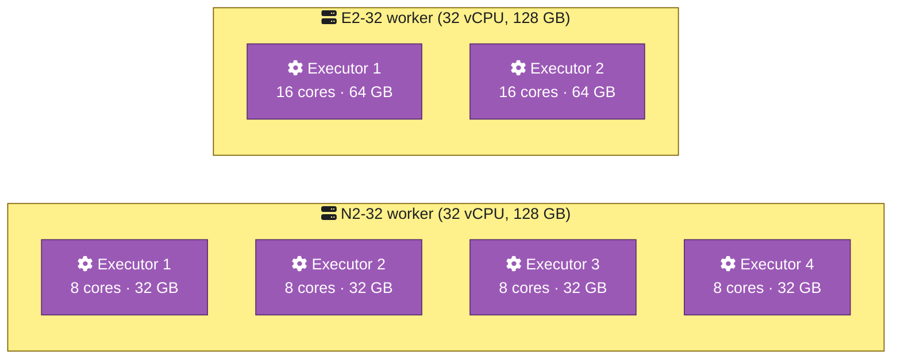
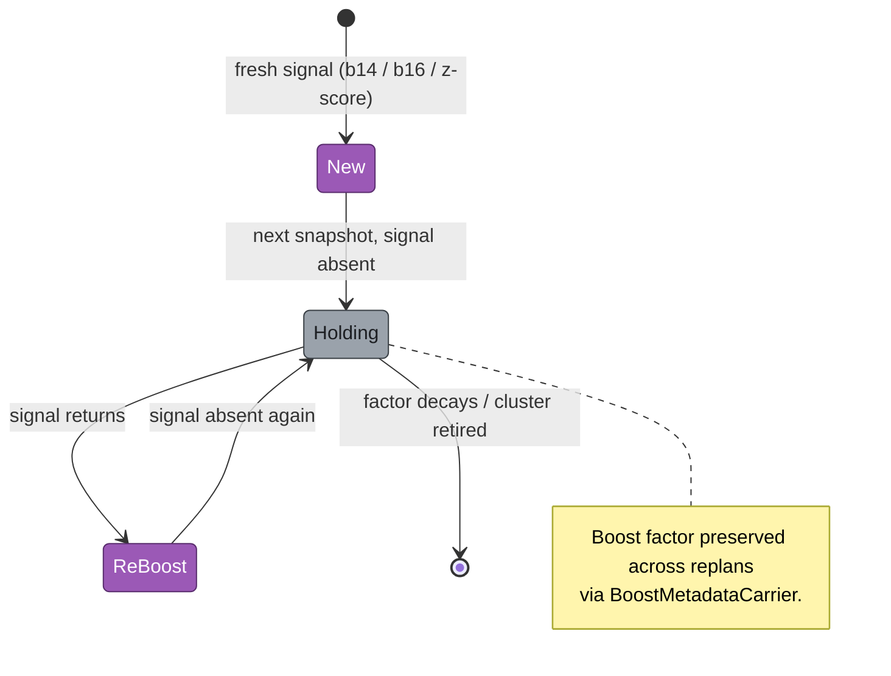

# Spark Cluster Job Tuner

> Cost-optimise your GCP Dataproc Spark jobs from real telemetry — no agents, no vendor lock-in, just CSV in / cluster config out.

[](https://github.com/albertols/spark-cluster-job-tuner/actions/workflows/ci.yml)
[](https://codecov.io/gh/albertols/spark-cluster-job-tuner)
[](LICENSE)
[](#)
[](#)
[](#)


## The 5-minute promise

Export 5 BigQuery Log Analytics queries to CSV, drop them in `inputs/<date>/`, run `mvn`, open the dashboard. That's it.

```bash
# 1. Build the slim server jar (one-time)
./mvnw -Pserve package

# 2. Run the auto-tuner on two snapshots
./mvnw -Pserve exec:java -Dexec.args="-cli auto --reference-date=2099_01_01 --current-date=2099_01_02"

# 3. Open the dashboard
./src/main/scala/com/db/serna/orchestration/cluster_tuning/auto/frontend/serve.sh
# → opens http://localhost:8080/ — start here
```

Sample data ships with `2099_01_01` and `2099_01_02` so the dashboard works out of the box. Replace with real exports when you're ready.

## Why does this exist?

Sizing GCP Dataproc clusters is guesswork. You either over-provision to be safe (and burn budget on idle workers) or you under-provision and watch jobs OOM at 3am. Vendor heuristics don't know your job patterns. ML-based "optimisers" are black boxes that hide their math.

This tool reads YOUR job history — straight from GCP Log Analytics + a tiny Spark listener you wire into your apps — and recommends concrete `clusterConf` + `recipeSparkConf` blocks per recipe. No agents, no vendors, no SaaS. Just data → math → JSON config you can paste back.

## How it works

The pipeline has three stages: **telemetry → analysis → recommendation**. The telemetry comes from two complementary sources, both surfaced as BigQuery Log Analytics queries:

1. **GCP-native logs** (`resource.type='cloud_dataproc_cluster'` + `dataproc.googleapis.com/autoscaler`) — automatic, free, capture cluster lifecycle and autoscaler events.
2. **`ExecutorTrackingListener`** — a small Spark `SparkListener` you add to your application (one line in `--conf spark.extraListeners=...`). Acts like F1-style telemetry, emitting executor lifecycle + stage-progress JSON logs that GCP Log Analytics indexes for free.

Together they feed five CSV exports (`b13`, `b14`, `b16`, `b20`, `b21`) — the "Boosted Vitamins" the recipes take to get fit. (Yes, that's why `RefinementVitamins.scala` exists.)

```mermaid
flowchart LR
  classDef document  fill:#9aa2ab,stroke:#3a4046,color:#1d1f23
  classDef process   fill:#9b59b6,stroke:#5a2d6e,color:#fff
  classDef spark     fill:#ff7a18,stroke:#8a3a00,color:#fff
  classDef cloud     fill:#4ea1ff,stroke:#1a4f8a,color:#fff
  classDef frontend  fill:#10b981,stroke:#054b34,color:#fff
  classDef inputBoundary  stroke-width:3px,stroke-dasharray:5 3
  classDef outputBoundary stroke-width:3px

  subgraph INPUTS ["📥 Telemetry sources"]
    direction TB
    app[fa:fa-bolt Your Spark App<br/><i>+ ExecutorTrackingListener</i>]:::spark
    cluster[fa:fa-cloud Dataproc cluster events<br/><i>resource.type=cloud_dataproc_cluster</i>]:::cloud
    autoscaler[fa:fa-cloud Dataproc autoscaler<br/><i>dataproc.googleapis.com/autoscaler</i>]:::cloud
  end
  class app,cluster,autoscaler inputBoundary

  logs[fa:fa-cloud GCP Log Analytics]:::cloud
  csv[fa:fa-file-csv inputs/&lt;date&gt;/*.csv<br/>b13 b14 b16 b20 b21]:::document
  tuner[fa:fa-cog SingleTuner / AutoTuner]:::process
  dashboard[fa:fa-desktop Dashboard<br/><i>./serve.sh</i>]:::frontend:::outputBoundary

  app -->|"executor lifecycle JSON logs"| logs
  cluster -->|"native log stream"| logs
  autoscaler -->|"native log stream"| logs
  logs -->|"BigQuery exports"| csv
  csv -->|"mvn"| tuner
  tuner -->|"_*.json + _*.csv"| dashboard
```

The tuner's job is then to pack executor slots inside Dataproc workers — different machine families give you different topology choices for the same per-recipe demand. The pair below shows two ways to hit the same 32-vCPU / 128-GB envelope:



See [`_LOG_ANALYTICS.md`](src/main/scala/com/db/serna/orchestration/cluster_tuning/log_analytics/_LOG_ANALYTICS.md) for the full SQL schema and [`_PARALLELISM.md`](src/main/scala/com/db/serna/utils/spark/parallelism/_PARALLELISM.md) for the listener.

## Dataproc Autoscaler vs Dataproc Serverless

This tool optimises **Dataproc Autoscaler** clusters (managed GCE workers, persistent or ephemeral). It does **NOT** target **Dataproc Serverless** — the optimisation surface is fundamentally different.

| | **Dataproc Autoscaler** | **Dataproc Serverless** |
|---|---|---|
| Management | Managed VMs (you tune sizing) | NoOps (Google tunes everything) |
| Scaling unit | Worker VMs added/removed via YARN signals | CPU/memory per-job, instant |
| Startup | Pre-provisioned (fast) | ~1-2 min cold start |
| Pricing | Per-VM-hour (idle worker = paid worker) | Per-second of execution (ephemeral) |
| Min footprint | ≥1 worker always running | Zero-when-idle |
| Best for | Sustained / predictable / high-volume jobs | Sparse / unpredictable / one-off jobs |

> **Why you can't just "let it scale"** — Dataproc Autoscaler is bounded by your GCP project's real constraints. A `/24` subnet caps you at ~250 IPs across all running clusters. An `N2-32` vCPU quota of 100 caps your max executor count regardless of YARN demand. This tool surfaces both: see the dashboard's per-cluster IP-budget hint and the per-region machine quota panel.

References: [Dataproc Autoscaling docs](https://cloud.google.com/dataproc/docs/concepts/configuring-clusters/autoscaling) · [Dataproc Serverless comparison](https://cloud.google.com/dataproc-serverless/docs/concepts/dataproc-compare).

## The marquee features

### 1. Boost lifecycle — the Vitamins in action

When a recipe's driver gets evicted (`b14`) or its heap OOMs (`b16`), the tuner stamps a **boost** on the next replan. Across snapshots, the boost lifecycle keeps state: a recipe boosted last week and still showing pain this week gets **re-boosted** (compounded factor). A recipe whose pain has subsided **holds** the prior boost without re-applying. Cluster retired? Boost decays to zero.



See [`_REFINEMENT.md`](src/main/scala/com/db/serna/orchestration/cluster_tuning/single/refinement/_REFINEMENT.md) and [`_AUTO_TUNING.md`](src/main/scala/com/db/serna/orchestration/cluster_tuning/auto/_AUTO_TUNING.md) for the lifecycle FSM and `BoostMetadataCarrier` mechanics.

### 2. Z-score executor SCALE-UP — statistical detection of cap touch

When a recipe is a duration outlier on the current snapshot (z ≥ 3.0 default) AND its `p95_run_max_executors / maxExecutors ≥ 0.5` (cap-touching), the tuner raises `spark.dynamicAllocation.maxExecutors` (×1.5 by default). No more guessing whether a job is throttled by autoscaler ceiling — the math tells you.


See `ExecutorScaleVitamin` in [`_REFINEMENT.md`](src/main/scala/com/db/serna/orchestration/cluster_tuning/single/refinement/_REFINEMENT.md).

### 3. Trends — Degraded / Improved / Stable / New / Dropped

The auto-tuner pairs reference and current snapshots, classifying each recipe's `p95_run_duration_ms` delta. New recipes (no prior data) and dropped ones (no current data) are surfaced separately, so you don't false-alarm on additions.


See `TrendDetector` and `StatisticalAnalysis` in [`_AUTO_TUNING.md`](src/main/scala/com/db/serna/orchestration/cluster_tuning/auto/_AUTO_TUNING.md).

### 4. Cost & Autoscaling Lens

`b20` (cluster span) + `b21` (autoscaler step events) drive a per-cluster cost view: reference vs current vs projected, with the actual scale-up / scale-down events overlaid on the timeline. Sits side-by-side with the actual `clusterConf` JSON and `recipeSparkConf` blocks per recipe — every value copyable, every change diffable.


See `PerformanceEvolver` in [`_AUTO_TUNING.md`](src/main/scala/com/db/serna/orchestration/cluster_tuning/auto/_AUTO_TUNING.md).

### 5. Statistical Lens — Pearson on normalised covariances

Cluster-wise and global-wise Pearson correlations on the normalised covariances of `p95_run_max_executors / maxExecutors`. Tells you which recipes share the same scaling pattern — and lets you eyeball whether the cluster is actually tuned, mostly tuned, or fundamentally mis-sized.


See `StatisticalAnalysis` in [`_AUTO_TUNING.md`](src/main/scala/com/db/serna/orchestration/cluster_tuning/auto/_AUTO_TUNING.md).

## Quickstart

### Static-CSV mode (simplest)

1. Drop your BigQuery exports as CSV files in `src/main/resources/composer/dwh/config/cluster_tuning/inputs/<YYYY_MM_DD>/`.
2. Run the tuner: `./mvnw -Pserve exec:java -Dexec.args="<YYYY_MM_DD>"` (single tuner) or `... -cli auto --reference-date=<YYYY_MM_DD> --current-date=<YYYY_MM_DD>` (auto-tuner).
3. Open the dashboard: `./src/main/scala/com/db/serna/orchestration/cluster_tuning/auto/frontend/serve.sh`.

### Dashboard-API mode (interactive)

```bash
./src/main/scala/com/db/serna/orchestration/cluster_tuning/auto/frontend/serve.sh --api
```

This boots the Scala `TunerService` backend, opens the dashboard, and unlocks the **wizard** flow: pick dates, choose strategies, run the tuner, see results — all from the browser.

### Dashboard tour

The dashboard is interactive end-to-end: every value is copyable, every cluster ID deep-links to its recipes, every recipe deep-links to a side-by-side ref vs current `clusterConf` + `recipeSparkConf` view. Click around — there's no "back" button hidden in a menu, every nav uses the URL.

## Extending it

Two extension points worth knowing:

### `TuningStrategy` — pick or write your own

Strategies are concrete classes implementing `TuningStrategy`. Three ship today (`DefaultTuningStrategy`, `CostBiasedStrategy`, `PerformanceBiasedStrategy` — see `single/TuningStrategies.scala`). To add your own, implement the interface:

```scala
object MyStrategy extends TuningStrategy {
  override def name: String = "my-strategy"
  override def executorTopology: ExecutorTopologyPreset =
    ExecutorTopologyPreset(cores = 16, memoryPerCoreGb = 2)
  override def biasMode: BiasMode = BiasMode.CostPerformanceBalance
  override def quotas: Quotas = Quotas(n2 = 256, n2d = 128)
  // …additional knobs (machineSelectionPreference, etc.) in TuningStrategies.scala…
}
```

Pass it via `--strategy=my-strategy` on the CLI; the dashboard's wizard surfaces all registered strategies in `wizard.js` automatically.

See [`_DESIGN.md`](src/main/scala/com/db/serna/orchestration/cluster_tuning/single/_DESIGN.md) for the strategy protocol.

### `RefinementVitamin` — composable boost behaviour

The boost lifecycle (described above under "Boost lifecycle — the Vitamins in action") is composed of independently-applied "vitamins" defined in `RefinementVitamins.scala`. Each vitamin reads a signal (b14 driver eviction, b16 OOM, z-score scale-up, …) and emits a per-recipe boost annotation. Add a new vitamin = add a new lifecycle code (`b14`, `b16`, `executor_scale`, plus your own) + a CSS chip colour in `frontend/style.css`.

See [`_REFINEMENT.md`](src/main/scala/com/db/serna/orchestration/cluster_tuning/single/refinement/_REFINEMENT.md).

## Project status

Local-only today — the tool runs on your machine against CSV exports you produce. **GCP-deployable** is on the [roadmap](ROADMAP.md) (see `C1`).

## Roadmap

See [`ROADMAP.md`](ROADMAP.md) for the active sub-projects (OSS readiness phases) and the major future initiatives: GCP-deployable (`C1`), specialised agents (`C2`), Markov-chain prediction (`C3`).

## Contributing

PRs welcome. Start with the [Quickstart](CONTRIBUTING.md#quickstart--your-first-pr-in-5-minutes) in `CONTRIBUTING.md` if you want to be in code within 5 minutes, or skip to the [Architecture orientation](CONTRIBUTING.md#architecture-orientation) for the deeper dive. The four "How to add a..." playbooks (TuningStrategy, RefinementVitamin, `bNN` query, dashboard tab) cover the most common contributions.

Looking for a place to start? The [Roadmap](ROADMAP.md) has Issues labelled `good first issue` — small, well-scoped, and contributor-friendly.

For questions and ideas, use [GitHub Discussions](https://github.com/albertols/spark-cluster-job-tuner/discussions). For security vulnerabilities, see [`SECURITY.md`](SECURITY.md). All participation is governed by the [Code of Conduct](CODE_OF_CONDUCT.md) (Contributor Covenant 2.1).

## Acknowledgements

Built on Apache Spark, Scala, and the GCP Dataproc + BigQuery + Log Analytics ecosystem. Test infra leans on ScalaTest and `holdenkarau/spark-testing-base`. Quality gates use Spotless (scalafmt) and scalafix (with SemanticDB). Coverage via Scoverage. CI via GitHub Actions.

## License

Apache License 2.0 — see [`LICENSE`](LICENSE).
