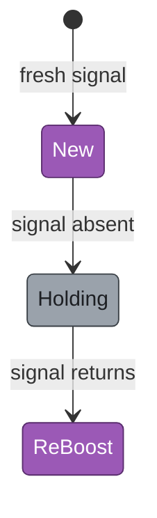
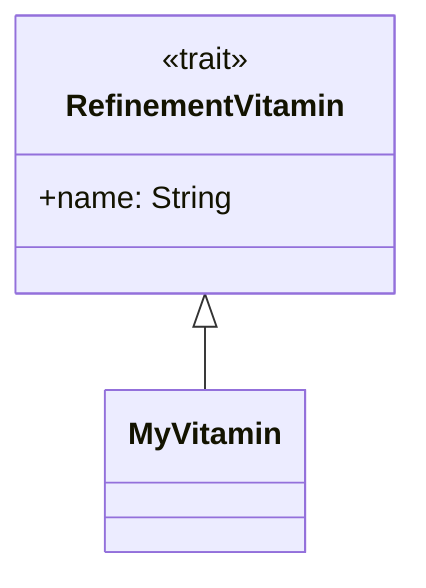
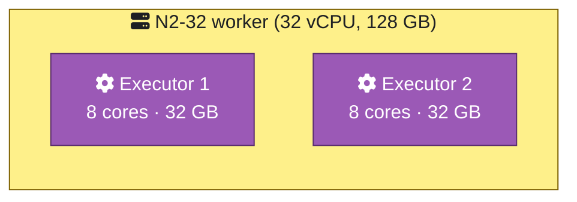

# Mermaid Style Guide

This is the single source of truth for Mermaid diagram styling in `spark-cluster-job-tuner`. Every diagram in the repo (`README.md`, `CONTRIBUTING.md`, `_DESIGN.md`, `_AUTO_TUNING.md`, `_REFINEMENT.md`, etc.) follows this guide. New diagrams should copy the canonical `classDef` block below and pick from the icon vocabulary — don't invent new categories without updating this doc.

The style is theme-agnostic: every colour reads on both Mermaid `default` (light) and `dark` themes. The landing page (`auto/frontend/index.html`) toggles theme via `prefers-color-scheme`; GitHub renders with its own bundled Mermaid theme.

---

## Quick start

Copy this block to the top of any new Mermaid diagram, then apply categories with `:::class` and add icons from the vocabulary table below.

```
%% Base categories — apply one per node
classDef document   fill:#9aa2ab,stroke:#3a4046,color:#1d1f23
classDef process    fill:#9b59b6,stroke:#5a2d6e,color:#fff
classDef spark      fill:#ff7a18,stroke:#8a3a00,color:#fff
classDef cloud      fill:#4ea1ff,stroke:#1a4f8a,color:#fff
classDef frontend   fill:#10b981,stroke:#054b34,color:#fff
classDef container  fill:#fef08a,stroke:#7a5e00,color:#1d1f23

%% Outcome modifiers — for trend / decision visualisation
classDef outcomeGood    fill:#1a3a1a,stroke:#2ecc71,color:#c8f0c8
classDef outcomeBad     fill:#3a1a1a,stroke:#e74c3c,color:#ffc8c8
classDef outcomeNeutral fill:#2a2a3a,stroke:#7f8c8d,color:#d5d8dc

%% Input / output boundary modifiers — compose with a base
classDef inputBoundary  stroke-width:3px,stroke-dasharray:5 3
classDef outputBoundary stroke-width:3px
```

Minimal example (a 3-node flowchart):

```mermaid
flowchart LR
  classDef document fill:#9aa2ab,stroke:#3a4046,color:#1d1f23
  classDef process  fill:#9b59b6,stroke:#5a2d6e,color:#fff
  classDef cloud    fill:#4ea1ff,stroke:#1a4f8a,color:#fff
  classDef inputBoundary stroke-width:3px,stroke-dasharray:5 3

  csv[fa:fa-file-csv inputs/b13.csv]:::document:::inputBoundary
  tuner[fa:fa-cog SingleTuner]:::process
  bq[fa:fa-cloud BigQuery]:::cloud

  bq --> csv --> tuner
```

---

## Categories

Six base categories cover all node taxonomies in the repo. Three outcome modifiers add trend/decision semantics. Two boundary modifiers flag inputs and outputs.

| Category | Fill | Stroke | Text | When to use |
|---|---|---|---|---|
| `document` | `#9aa2ab` (shadow grey) | `#3a4046` | dark | `.csv`, `.sql`, `.json`, `.txt`, `.md`, any data file |
| `process` | `#9b59b6` (purple) | `#5a2d6e` | white | `.scala` classes, pipeline steps, generic processing |
| `spark` | `#ff7a18` (orange) | `#8a3a00` | white | Spark App, ExecutorTrackingListener, executor topology |
| `cloud` | `#4ea1ff` (sky blue) | `#1a4f8a` | white | GCP services: Log Analytics, BigQuery, GCS, Dataproc cluster, autoscaler |
| `frontend` | `#10b981` (emerald) | `#054b34` | white | Dashboard, landing page, wizard UI |
| `container` | `#fef08a` (soft amber) | `#7a5e00` | dark | Subgraphs grouping nodes (worker VMs, cluster boundaries) |

### Outcome modifiers

| Modifier | Fill | Stroke | Text | When to use |
|---|---|---|---|---|
| `outcomeGood` | `#1a3a1a` (dark green) | `#2ecc71` | light green | "Improved" trend, successful path, action with positive impact |
| `outcomeBad` | `#3a1a1a` (dark red) | `#e74c3c` | light red | "Degraded" trend, failure path, action with negative impact |
| `outcomeNeutral` | `#2a2a3a` (slate) | `#7f8c8d` | light gray | "Stable" trend, ambiguous outcome, neutral state |

Outcome modifiers OVERRIDE the base fill — apply them when the SEMANTIC of the node is "this is a positive/negative outcome," not "this is a process/file." They preserve the dark-fill + light-text pattern from the original `_AUTO_TUNING.md` palette where it was working.

### Boundary modifiers

| Modifier | Style |
|---|---|
| `inputBoundary` | thicker stroke (3px) + dashed (`5 3`) — visually says "data enters here" |
| `outputBoundary` | thicker stroke (3px) — solid; visually says "data exits here" |

Compose with any base via Mermaid's multi-class syntax: `node[label]:::process:::outputBoundary`.

---

## Icon vocabulary

| Concept | FontAwesome | Emoji fallback | When |
|---|---|---|---|
| Folder / directory | `fa:fa-folder` | 📁 | Subgraph titles representing dirs (`📁 inputs/<date>/`) |
| CSV file | `fa:fa-file-csv` | 📄 | Document nodes named `*.csv` |
| SQL file | `fa:fa-database` | 🗄️ | bNN.sql nodes |
| JSON file | `fa:fa-file-code` | 📋 | Output JSON nodes |
| Markdown / text | `fa:fa-file-alt` | 📝 | README, docs, log output |
| Process / Scala class | `fa:fa-cog` | ⚙️ | Tuner / Refinement / generic processing |
| Spark / executor | `fa:fa-bolt` | ⚡ | Spark App, ExecutorTrackingListener |
| Dashboard / landing | `fa:fa-desktop` | 🖥️ | UI surfaces |
| Cloud / GCP service | `fa:fa-cloud` | ☁️ | Log Analytics, BigQuery, GCS, Dataproc |
| Date / snapshot | `fa:fa-calendar` | 🗓️ | DateSnapshot, ref/current |
| Statistical analysis | `fa:fa-chart-bar` | 📊 | TrendDetector, StatisticalAnalysis |
| State / lifecycle | (use stateDiagram-v2 syntax) | — | Boost lifecycle states (no inline icon) |
| Worker / VM | `fa:fa-server` | 🖧 | Container subgraphs (N2-32 etc.) |
| Decision / branch | `fa:fa-code-branch` | 🔀 | Decision diamonds in flowcharts |
| Pair / link | `fa:fa-link` | 🔗 | MetricsPair, snapshot pairing |
| Input boundary prefix | — | 📥 | Entry node label prefix |
| Output boundary prefix | — | 📤 | Exit node label prefix |

**Strict rule:** one diagram, one icon style. All FontAwesome OR all emoji within a single diagram. Mixing is allowed only when a specific concept has no FontAwesome equivalent (e.g., 📥/📤 input/output prefixes don't have a clean FA replacement).

---

## Input / output highlighting

Two patterns, picked by node count:

### Subgraph wrapper (3+ entry/exit nodes)

```
subgraph INPUTS ["📥 Inputs (BigQuery exports)"]
  B13[fa:fa-file-csv b13.csv]:::document
  B14[fa:fa-file-csv b14.csv]:::document
  B16[fa:fa-file-csv b16.csv]:::document
end
class B13,B14,B16 inputBoundary
```

The subgraph title carries the 📥 emoji; the inner nodes get the dashed `inputBoundary` modifier on top of their base `document` class.

### Icon-prefix only (1-2 entry/exit nodes)

```
A[📥 Snapshot read]:::process:::inputBoundary
Z[📤 JSON output]:::document:::outputBoundary
```

The node label carries the 📥/📤 prefix; the boundary modifier handles the visual stroke.

**Decision rule:** count entry/exit nodes. ≥3 → wrapper. ≤2 → icon prefix.

---

## Diagram-type cheatsheet

Mermaid supports several diagram types. Each has a slightly different way of applying styles. Canonical examples for each type used in this repo:

### `flowchart LR` / `flowchart TD`


### `stateDiagram-v2`



State diagrams use `class StateName className` (singular, after the diagram body) instead of `:::class` inline.

### `classDiagram` (UML)



`classDiagram` styling is more limited — only `cssClass "node1,node2" className` works for visual classes. The `classDef` block is still used to define the class. **Caveat:** some `classDef` properties (like `stroke-dasharray`) may not render in `classDiagram` — verify visually.

### `subgraph` nesting (containers)



Style the subgraph itself with `class SUBGRAPH_ID className` (after the `end`). Inner nodes get their own classes individually.

---

## Theme compatibility

Every colour in the canonical block has been verified to read on both `theme: 'default'` (light background) and `theme: 'dark'` (dark background) Mermaid themes.

The mid-tone fills + dark strokes pattern is the empirical sweet spot — saturated enough to stand out on light backgrounds, light enough to read on dark backgrounds. The outcome modifiers (`outcomeGood/Bad/Neutral`) intentionally use dark fills + light text because they signal trend semantics, not node taxonomy — the visual contrast (base = mid-tone, outcome = dark) is the point.

The landing page initialises Mermaid with theme detection:

```javascript
const dark = window.matchMedia('(prefers-color-scheme: dark)').matches;
mermaid.initialize({ startOnLoad: false, theme: dark ? 'dark' : 'default' });
```

GitHub renders with its own bundled Mermaid version (typically lags 1-2 minor versions); `classDef` + multi-class composition + state diagram class syntax are all in the safe set since Mermaid 8.x.

---

## Anti-patterns

- ❌ **Don't use inline `style X fill:...`.** Always define a `classDef` and apply via `:::class` (or `class X className` for state/class diagrams). Inline styles can't be reused or themed.
- ❌ **Don't invent new categories.** If you need a new colour or icon, PR-update this guide first; then apply across existing diagrams to keep the vocabulary consistent.
- ❌ **Don't mix icon styles within one diagram.** All FontAwesome OR all emoji. The exception is 📥/📤 input/output prefixes, which have no clean FA equivalent.
- ❌ **Don't apply `outcomeGood`/`outcomeBad` to taxonomy nodes.** Those modifiers are for SEMANTICS (positive/negative outcome), not node types. A `process` that completes successfully isn't `outcomeGood`; it's `process`. A "Cluster sized correctly" annotation node IS `outcomeGood`.
- ❌ **Don't omit the `classDef` block.** Even if a diagram has only 2 nodes, paste the relevant `classDef` lines so the diagram is self-contained.

---

## Maintenance

When adding a new category or icon:

1. Open a PR updating this doc.
2. Update the categories or icon vocabulary table.
3. Apply across any existing diagrams that would benefit (don't leave ad-hoc one-off colours floating in the codebase).

When upgrading Mermaid version (in landing's `index.html` or via GitHub's bundled version):

1. Verify all 9 existing diagrams still render correctly under both light + dark themes.
2. If any new Mermaid features become available (e.g., `architecture-beta` icon packs), evaluate as a follow-up — don't silently swap unless the upgrade is broadly beneficial.
