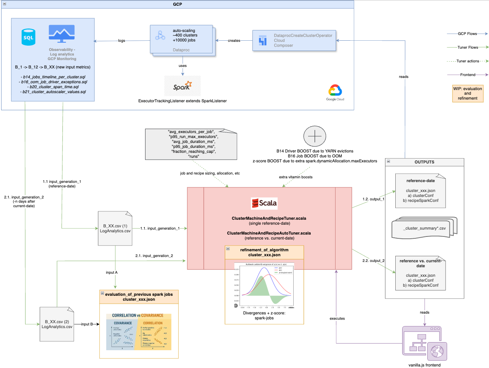
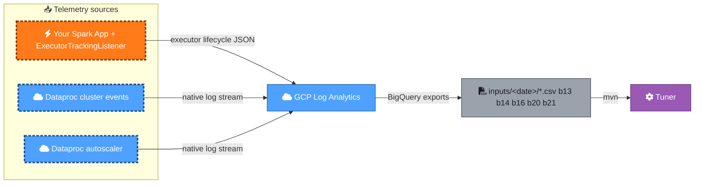

<!-- Medium publication metadata
  Title:    Part 1: F1 telemetry for your Spark cluster: the BigQuery Log Analytics setup that costs nothing
  Subtitle: How a tiny Spark listener + 5 GCP Log Analytics queries + Tuner.scala + cool frontend replace expensive BigQuery export pipelines for cluster sizing and SRE.
  Tags:     spark, gcp, dataproc, data-engineering, observability
  Canonical URL: https://github.com/albertols/spark-cluster-job-tuner/blob/main/docs/articles/2026-05-09-part-1-telemetry.md
-->

# F1 Telemetry and Tuning for your Spark cluster: the BigQuery Log Analytics setup that costs nothing

> I can do auto tuning (every day) for +10000 spark jobs and ~400 clusters. Seamlessly SRE, cost tracking/optimisations and serious balance machine and resource allocation.
How a tiny Spark listener + 5 GCP Log Analytics queries + Tuner.scala + frontend (as a perk) replace expensive BigQuery export pipelines for cluster sizing, SRE operability and makes resource allocation and "spark tuning" data-math driven.

## TL;DR

- A tiny `SparkListener` (~200 lines) emits structured executor lifecycle JSON your Spark app already runs — no extra infra.
- Five GCP Log Analytics queries (`b13`, `b14`, `b16`, `b20`, `b21`) turn that telemetry plus native Dataproc events into actionable signals for cluster sizing.
- Log Analytics' per-query pricing model is dramatically cheaper than the equivalent BigQuery exports for this workload — same data, fraction of the cost.
- Feeding the ClusterMachineAndRecipeAutoTuner.scala, reference-date (single tuner) and reference vs. current-data (Auto Tuner, like clamping one of those Tuners in your guitar :D )

> DISCLAIMER: I got carried away and I decided to make it shine with a frontend to make SRE a bit more fun....evolving this into a full interactive Spark job - CLuster full suite... STAY TUNED!!!

## The cost-vs-blindness trade-off

### Dataproc Serverless

GCP offers a **NoOps** alternative to managed clusters: **Dataproc Serverless**. Submit a Spark job, Google handles the rest — no VMs to provision, no YARN to babysit, per-second billing, zero idle cost. For the right workload, it's the obvious choice.

But "the right workload" is narrower than the marketing suggests:

| | **Dataproc Autoscaler** | **Dataproc Serverless** |
|---|---|---|
| Management | Managed VMs (you tune sizing) | NoOps (Google tunes everything) |
| Scaling unit | Worker VMs added/removed via YARN signals | CPU/memory per-job, instant |
| Startup | Pre-provisioned (fast) | ~1–2 min cold start per submission |
| Pricing | Per-VM-hour (idle worker = paid worker) | Per-second of execution (ephemeral) |
| Min footprint | ≥1 worker always running | Zero-when-idle |
| Tunable knobs | Machine family, executor topology, autoscaler bounds, ~30+ Spark properties — **per recipe** | Driver/executor cores + memory + basic autoscaling bounds. That's it. |
| Job-history forensics | Full executor lifecycle preserved on cluster | Per-job, ephemeral, harder to mine for patterns |
| Best for | Sustained / predictable / high-volume / fleet-wide tuning | Sparse / unpredictable / one-off jobs |

**Why this tool targets Autoscaler, not Serverless.** The whole point of fine-grained tuning is that **+400 clusters running +10 000 daily Spark jobs** are not interchangeable. One DWH ETL recipe needs `16c × 4 GB/c` executors because it's shuffle-bound; a stream-ingestion recipe two folders away needs `4c × 2 GB/c` because it's compute-bound. A trends pipeline at 09:00 needs 50 executors; the same pipeline at 03:00 needs 8. These patterns only become visible when you can SEE the topology you're picking — exactly the surface Serverless hides.

Three concrete reasons Serverless breaks down at this scale:

1. **The cost math inverts.** Per-second billing wins when jobs are sparse and clusters would otherwise idle. At 10 000 jobs/day across 400 clusters, those clusters are NEVER idle for long — workers amortise across hundreds of runs and pre-provisioned VMs become dramatically cheaper than per-second-billed elastic capacity. Layer on **~1–2 min cold start × 10 000 jobs/day** and you're paying real wall-clock and CPU-seconds for nothing useful.
2. **Quota economics.** A serverless submission requests fresh capacity every time. At this volume you'll hit project-wide vCPU + IP quotas constantly. A few hundred long-lived autoscaled clusters reuse capacity efficiently — and this tool's machine-selection picks **inside** those quota envelopes (see the dashboard's quota panel).
3. **There's nothing to tune.** Serverless exposes maybe a dozen knobs total. Autoscaler exposes a configuration surface large enough that a `bNN` telemetry signal can meaningfully change the recommendation per (cluster, recipe). Without that surface, the [`ClusterMachineAndRecipeAutoTuner.scala`](https://github.com/albertols/spark-cluster-job-tuner/blob/main/src/main/scala/com/db/serna/orchestration/cluster_tuning/auto/ClusterMachineAndRecipeAutoTuner.scala) would have nothing to recommend.

> **TL;DR:** Use Serverless for the irregular long-tail (ad-hoc analyst queries, one-shot pipelines). Use Autoscaler — and this tool — for the high-volume backbone where every percent of efficiency, multiplied by 10 000 daily runs, becomes real money.

References: [Dataproc Autoscaling docs](https://cloud.google.com/dataproc/docs/concepts/configuring-clusters/autoscaling) · [Dataproc Serverless comparison](https://cloud.google.com/dataproc-serverless/docs/concepts/dataproc-compare).

### Dataproc Autoscaler

Sizing GCP Dataproc clusters is guesswork. Most teams pick one of two losing strategies: over-provision to be safe (visible cost — idle workers burning budget) or under-provision and hope (hidden cost — failed jobs at 3am, slow scale-up, OOMs).

Both strategies are forced by the same root cause: nobody can see what their Spark jobs actually do. The data you'd need lives in `local[*]` event streams that GCP doesn't surface, in autoscaler decisions buried in obscure log channels, in driver crash stacktraces nobody reads.

What if you could measure cheaply, surface the right signals, and feed them straight into a cluster-sizing recommendation?

That's what the Spark Cluster Job Tuner does. This article is about its **input layer** — the telemetry side. The next article walks through the tuner itself.

## Two telemetry sources, one pipeline

The pipeline pulls signals from two complementary sources, both surfaced via GCP Log Analytics:

**1. GCP-native Dataproc logs.** Dataproc emits structured logs to two log resource types:

- `cloud_dataproc_job` — Spark application logs (where your driver writes everything via log4j2 + your `SparkListener`s).
- `dataproc.googleapis.com/autoscaler` — autoscaler decisions (`min/max executor` changes, scale-up trigger reasons).

These are automatic — every Dataproc cluster emits them, no app-side wiring needed. Coarse-grained but free.

**2. The [`ExecutorTrackingListener`](https://github.com/albertols/spark-cluster-job-tuner/blob/main/src/main/scala/com/db/serna/utils/spark/parallelism/ExecutorTrackingListener.scala).** This is a custom `SparkListener` (~200 lines of Scala) you add to your Spark application via one config line: `--conf spark.extraListeners=com.db.serna.utils.spark.parallelism.ExecutorTrackingListener`. It hooks into Spark's listener bus and emits structured JSON for every executor add / remove / state-change event, every stage start / completion, every task batch.

Think of it as **F1 telemetry for your Spark engine**. F1 cars stream hundreds of channels (engine RPM, tyre pressure, brake temperature, downforce) at 1000 Hz so engineers can reason about exactly what happened on each lap. Your Spark app can do the same — what executors fired up when, what tasks they ran, where they died — for the cost of a single listener registration.

The two sources together feed five BigQuery Log Analytics queries that produce the CSV exports the tuner consumes:

## The five queries: what each captures

Each Log Analytics query is named `bNN_<purpose>.sql` and ships with a structured 6-line header (`Purpose / Telemetry / GCP source / App source / Consumed`) so contributors can navigate the actual SQL files. In plain language:

- **[`b13_recommendations_inputs_per_recipe_per_cluster.sql`](https://github.com/albertols/spark-cluster-job-tuner/blob/main/src/main/scala/com/db/serna/orchestration/cluster_tuning/log_analytics/b13_recommendations_inputs_per_recipe_per_cluster.sql)** — the workhorse. Joins `cloud_dataproc_job` events with `ExecutorTrackingListener` payloads to compute per-recipe baseline metrics: average executors used, p95 run duration, max executors observed, run counts, fraction of runs hitting the autoscaler cap. **Both** GCP-native + app-side.
- **[`b14_clusters_with_nonzero_exit_codes.sql`](https://github.com/albertols/spark-cluster-job-tuner/blob/main/src/main/scala/com/db/serna/orchestration/cluster_tuning/log_analytics/b14_clusters_with_nonzero_exit_codes.sql)** — clusters where job exit codes signal driver eviction (typically YARN preemption or OOM-kill). **GCP-native** only. Feeds the boost-lifecycle vitamin that bumps driver memory on the next replan.
- **[`b16_oom_job_driver_exceptions.sql`](https://github.com/albertols/spark-cluster-job-tuner/blob/main/src/main/scala/com/db/serna/orchestration/cluster_tuning/log_analytics/b16_oom_job_driver_exceptions.sql)** — driver-side Java heap OOM events per recipe. Pulls Spark driver stacktraces (`cloud_dataproc_job` + `log_name=dataproc.job.driver`) AND correlates with `ExecutorTrackingListener` lifecycle events for context. **Both**. Feeds the heap-boost vitamin.
- **[`b20_cluster_span_time.sql`](https://github.com/albertols/spark-cluster-job-tuner/blob/main/src/main/scala/com/db/serna/orchestration/cluster_tuning/log_analytics/b20_cluster_span_time.sql)** — per-cluster wall-clock active window (from / to timestamps). **GCP-native**. Drives cluster cost computation and per-recipe attribution windows.
- **[`b21_cluster_autoscaler_values.sql`](https://github.com/albertols/spark-cluster-job-tuner/blob/main/src/main/scala/com/db/serna/orchestration/cluster_tuning/log_analytics/b21_cluster_autoscaler_values.sql)** — autoscaler scale events (`min/max` executor changes over time). **GCP-native**, sourced from the dedicated `dataproc.googleapis.com/autoscaler` log stream. Drives the autoscaling-lens visualisation and step-function cost.

You export each as CSV from Log Analytics' UI, drop them in `inputs/<YYYY_MM_DD>/`, and the tuner takes it from there.

## The cost angle: Log Analytics vs BigQuery

The same data could in principle live in BigQuery via Dataproc's BigQuery export pipeline. Why use Log Analytics instead?

**Log Analytics charges per query** — you pay for the bytes scanned during query execution, with a generous monthly free tier. **BigQuery exports** add storage cost (every byte sits in a BQ table forever) plus query cost on top.

For the cluster-tuning workload — small intermittent reads, no joins across petabyte tables, no aggregations beyond `GROUP BY`-with-time-windows — Log Analytics is dramatically cheaper. **Order-of-magnitude cheaper for this workload pattern**, in our experience. And there's a second hidden win: Log Analytics CSV exports flow through the GCP Console UI without needing a service account with `bigquery.tables.export` IAM. You don't need PRD IAM roles to download the CSVs.

So the full input loop is: wire `ExecutorTrackingListener` once, paste five SQL queries into Log Analytics, click "Export to CSV", drop the files in `inputs/<date>/`, run the tuner. No BigQuery billing surprise. No PRD permission ticket.

WIP: in the future BigQuery can play a crucial role for placing in-between a debugging telemetry at spark job level: stages, tasks, etc and feed an Agentic layer for L2, L3, Spark Stage shuffle/repartition/caching/refactor recommenadtor as well as leveraging metrics in a more predicitve way: Markov Chains?
References:
https://pmc.ncbi.nlm.nih.gov/articles/PMC9371413/
https://www.computer.org/csdl/journal/ts/2022/03/09134972/1lgLvU6IlXy

## What's next

PART_2 picks up where this article ends: with five CSV files sitting in `inputs/<date>/`, how does the tuner turn them into actionable `clusterConf` + `recipeSparkConf` blocks? It's the math, the boost lifecycle FSM, the dashboard that shows you exactly where the recommendations come from.

[Read PART_2 →](2026-05-09-part-2-tuners-and-frontend.md)

If this was useful: ⭐ the [Spark Cluster Job Tuner repo on GitHub](https://github.com/albertols/spark-cluster-job-tuner), wire `ExecutorTrackingListener` into one of your Spark apps, and let me know what you find.
