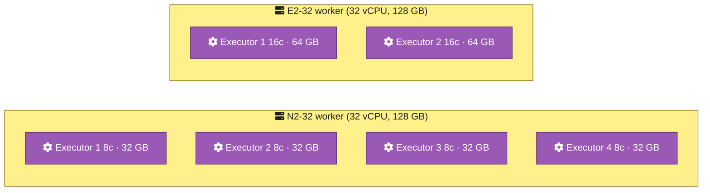
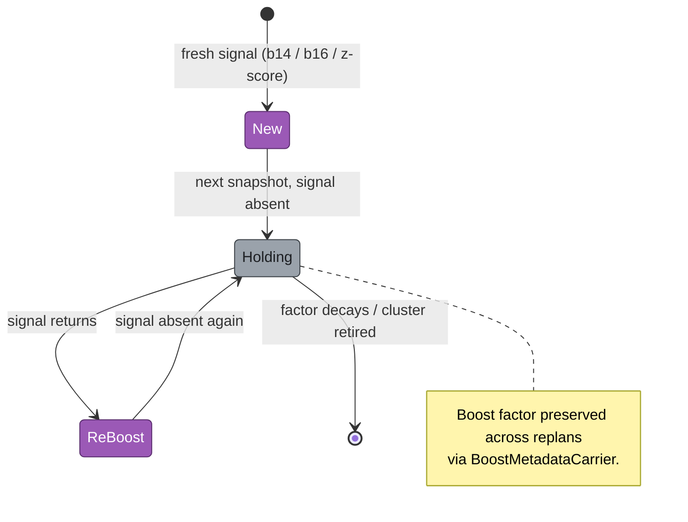

<!-- Medium publication metadata
  Title:    From CSV to optimized cluster config in 5 minutes: the tuner that reads your Spark history
  Subtitle: Single-date tuner, multi-snapshot auto-tuner, statistical boost lifecycle, and a dashboard that shows the math.
  Tags:     spark, gcp, dataproc, data-engineering, cluster-tuning
  Canonical URL: https://github.com/albertols/spark-cluster-job-tuner/blob/main/docs/articles/2026-05-09-part-2-tuners-and-frontend.md
-->

# From CSV to optimized cluster config in 5 minutes: the tuner that reads your Spark history

> Single-date tuner, multi-snapshot auto-tuner, statistical boost lifecycle, and a dashboard that shows the math.

## TL;DR

- The **Single Tuner** picks a machine family + executor topology per recipe from one date's metrics — `clusterConf` JSON in, `recipeSparkConf` out.
- The **Auto-Tuner** pairs reference + current snapshots, classifies trends (Degraded / Improved / Stable / New / Dropped), and runs a **boost lifecycle FSM** (`New → Holding ⇄ ReBoost`) that preserves state across replans.
- A **z-score executor scale-up** detects recipes that are duration outliers AND cap-touching, and raises `spark.dynamicAllocation.maxExecutors` ×1.5. The dashboard shows the math: Pearson correlations, divergence z-scores, scale-up reasons.

## From CSVs to actionable config

[Part 1](2026-05-09-part-1-telemetry.md) ended with five CSVs sitting in `inputs/<date>/`. This article picks up there: how the tuner turns those signals into a concrete `clusterConf` + `recipeSparkConf` JSON pair you can paste straight into your Dataproc setup.

The pipeline has two entry points. The Single Tuner takes ONE date's metrics and produces a recommendation per recipe. The Auto-Tuner takes TWO dates (a "reference" baseline and the "current" snapshot you want to evaluate), pairs them, and emits delta-aware recommendations. Both share the same machine-selection + topology-planning core; the Auto-Tuner adds trend classification and the boost lifecycle on top.

## Single Tuner: machine + topology per recipe

The Single Tuner's job per recipe: pick a Dataproc machine family, pick an executor topology preset, and emit Spark config knobs that respect both.

**Machine selection** uses a priority + score system. The priority order favours `N2-32` first, then `N2D-32`, then `E2-32` — based on `europe-west3` pricing and steady-state cost-per-vCPU calculations. 32-core machines also get a `-0.10` score bonus because larger workers reduce per-cluster overhead. `C3-32` and `C4-32` are capped at 1 cluster each (limited quota in most projects). `N4` and `N4D` are excluded by default — they're newer and per-region availability varies.

**Executor topology** is preset-driven via `ExecutorTopologyPreset(cores, memoryPerCoreGb)`. The default is `8c × 1GBpc` — 8 cores per executor, 1 GB per core, totalling 8 GB executor memory. So an `N2-32` worker (32 vCPU, 128 GB) packs 4 executors of 8 cores / 32 GB; an `E2-32` packs 2 executors of 16 cores / 64 GB at the `16c × 4GBpc` preset. The choice of preset is per recipe — different workloads benefit from different shapes.

The output is one of two modes per recipe: **manual** (`spark.executor.instances` fixed) or **auto-scale** (`spark.dynamicAllocation.{enabled,minExecutors,maxExecutors}`). The Auto-Tuner extends this with cross-snapshot intelligence.

## Auto-Tuner: snapshots, trends, and the boost lifecycle FSM

The Auto-Tuner pairs two snapshots — a reference (older) and current (newer) — and asks: per recipe, what changed?

`TrendDetector` classifies each pair into one of five buckets: **Degraded** (current is meaningfully worse than reference on `p95_run_duration_ms`), **Improved** (better), **Stable** (within tolerance), **New** (no reference data — recipe didn't exist before), or **Dropped** (no current data — recipe disappeared). New + Dropped are surfaced separately so you don't false-alarm on additions.

When a recipe shows pain — say, b14 reports the driver was YARN-evicted, or b16 reports a heap OOM — the tuner stamps a **boost** annotation. A boost is a multiplicative factor applied to the affected Spark setting (driver memory, executor memory, etc.) on the next replan. The boost lifecycle is what makes this stateful across snapshots:

A recipe with a fresh OOM signal goes `New` → boost applied. Next snapshot, no OOM signal → `Holding` (boost preserved, not re-multiplied). Snapshot after that, OOM returns → `ReBoost` (factor compounded). The `BoostMetadataCarrier` mechanism injects this state from the prior date's output JSON into the current replan, so a recipe boosted last week still has its boost when re-planned today, even if the b16 CSV no longer reports the OOM.

## Z-score scale-up + the Statistical Lens

The most subtle piece of the math is the **z-score executor scale-up**. The reasoning: a recipe might run "fine" on average but consistently be a **duration outlier** — a runtime z-score ≥ 3.0 against the cluster's distribution. AND it might consistently be **cap-touching** — its `p95_run_max_executors / spark.dynamicAllocation.maxExecutors ≥ 0.5`. Both together mean the autoscaler ceiling is the bottleneck. The tuner raises the maxExecutors ×1.5 (configurable via `--executor-scale-factor`).

The dashboard's **Divergences** tab shows every cap-touching outlier with its z-score, p95-vs-cap ratio, and the proposed new max. You can sort by any column.

The **Trends** tab classifies recipes into the 5 buckets (Degraded / Improved / Stable / New / Dropped) at-a-glance:

And the **Statistical Lens** runs Pearson correlations on the normalised covariances of `p95_run_max_executors / maxExecutors` across recipes per cluster — telling you which recipes share scaling patterns:

The whole dashboard is interactive end-to-end. Click any cluster to drill into its recipes; click any recipe to see the proposed `clusterConf` + `recipeSparkConf` JSON side by side. Every value is copyable.

> 💭 **[Your voice goes here]**
>
> War story slot. Suggestions:
> - A specific cluster you tuned: starting cost, ending cost (€/month), what the math caught that you'd have missed.
> - The "aha" moment when the boost lifecycle clicked — what real recipe finally surfaced it?
> - Why z-score cap-touch detection beats simpler threshold rules — concrete example where a flat threshold would have missed.

## What's next

PART_4 looks forward: where the tool goes from here. Local-only today, scheduled-on-GCP next. Three specialised agent personas wrap the tuner. Markov-chain prediction turns reactive trend analysis into forecasting.

[Read PART_4 →](2026-05-09-part-4-future-direction.md)

If this was useful: clone [the repo](https://github.com/albertols/spark-cluster-job-tuner), run `./mvnw -Pserve package && ./src/main/scala/com/db/serna/orchestration/cluster_tuning/auto/frontend/serve.sh` against the bundled `2099_01_01` / `2099_01_02` sample data, and click around. Then point it at your own job history.
