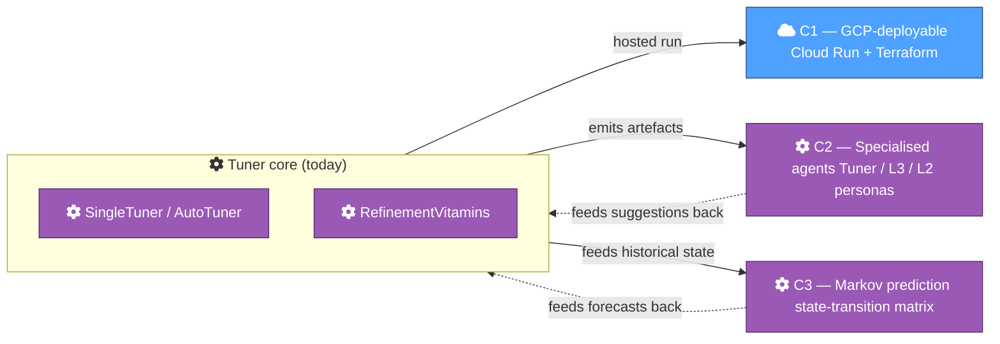

<!-- Medium publication metadata
  Title:    The road from local tuner to autonomous cluster optimisation
  Subtitle: GCP-deployable, specialised agents, Markov-chain prediction — the roadmap.
  Tags:     spark, gcp, dataproc, data-engineering, roadmap
  Canonical URL: https://github.com/albertols/spark-cluster-job-tuner/blob/main/docs/articles/2026-05-09-part-4-future-direction.md
-->

# The road from local tuner to autonomous cluster optimisation

> GCP-deployable, specialised agents, Markov-chain prediction — the roadmap.

## TL;DR

- Local-only today; **C1** moves the tuner to a scheduled-on-GCP deployment (Cloud Run + Terraform IaC + GCS-backed cache).
- **C2** wraps the tuner in three specialised agent personas (Tuner Proposal, L3 Spark Optimiser, L2 PRD Failure Analyst) with A2A-style communication.
- **C3** turns the deterministic AutoTuner's reactive trend analysis into Markov-chain forecasting + scenario simulation, without an opaque ML model.

## Where the tool is today, and where it's headed

The Spark Cluster Job Tuner today is a local-only command-line + dashboard. You export CSVs from GCP Log Analytics, run `./mvnw`, click around the dashboard, paste the recommended `clusterConf` JSON into your Dataproc setup. That's enough to extract real value — but it caps the audience at engineers willing to do the dance themselves.

The roadmap targets three independent axes of evolution. None of them is built today; all three have substantive [GitHub Issues](https://github.com/albertols/spark-cluster-job-tuner/issues?q=is%3Aopen+label%3Aroadmap) carrying the design framing and inviting contributors. Pick whichever speaks to you.

## C1 — GCP-deployable

Today: local laptop, manual CSV export, zip-and-email the dashboard if you want to share it. C1's vision: scheduled or on-demand tuning runs on GCP, dashboard hosted at `https://tuner.<your-domain>.run.app`, outputs persisted in GCS.

Sketch:

- **Scheduled BigQuery exports.** Cloud Scheduler triggers a Cloud Run job that runs the 5 Log Analytics queries and writes CSVs to a date-partitioned GCS bucket (`gs://bucket/inputs/<YYYY_MM_DD>/`).
- **Frontend hosting.** The static dashboard + the small Java `TunerService` backend deploy to Cloud Run (or App Engine — sub-decision). Reads inputs and writes outputs from the same GCS bucket.
- **Cache layer.** GCS bucket for tuner JSON / CSV outputs so the dashboard doesn't re-run the tuner on every page load.
- **Terraform IaC.** An `infra/` module covering the bucket, Cloud Run services, IAM bindings (least-privilege Service Accounts), the scheduler job, and the necessary BigQuery roles. `terraform apply` from a clean GCP project bootstraps the whole thing in <10 minutes.

Open questions: Cloud Run vs App Engine? Per-date GCS layout vs flat with metadata? Roll-our-own deployment vs a higher-level framework? The C1 Issue invites contributors to weigh in.

## C2 — Specialised agents

Today: the tuner emits structured JSON + CSV outputs and a dashboard, expecting a human to interpret. C2 wraps three agent personas around that output, surfacing actionable insights without anyone staring at the dashboard.

- **Agent 1 — Tuner Proposal.** Reads existing `_*.json` outputs + `bNN.csv` inputs at recipe + cluster level, applies the trend logic (covariances, z-scores, Pearson) already in the codebase, and emits structured tuning-recommendation reports — Markdown or Slack-formatted. Closes the loop "tuner ran → here's what I'd merge."
- **Agent 2 — L3 Spark Job Optimiser.** Deep job-level optimisation — shuffle, caching, parallelism, broadcast hints — using `ExecutorTrackingListener` evolution + Spark internal APIs. Inspired by Databricks Optimiser-style tooling but as OSS.
- **Agent 3 — L2 PRD Failure Analyst.** Analyses failed PRD jobs (`BQ.EXECUTION_TABLES` → logs → root cause → action). Talks to Agents 1 + 2 for context — e.g., "performance degradation upstream → OOM crash chain."

The agents communicate via an A2A (Agent-to-Agent) protocol — proprietary JSON, MCP, ACP, the standard A2A — to be settled by Agent 3's design. Security is non-negotiable: least-privilege Service Accounts, scoped BigQuery + GCS read access, no exfiltration paths beyond the configured output channel.

This is the most speculative of the three initiatives. The C2 Issue is honest about what's "vision" versus what's "ready to build." Contributors who like building agentic systems on GCP — read it, push back, claim a piece.

## C3 — Markov-chain prediction

Today: the AutoTuner is **reactive**. It pairs reference and current snapshots, classifies trends, recommends. It doesn't predict — "given the last N days, where is this cluster headed?" or "what happens if I switch to `PerformanceBiasedStrategy` for this recipe?"

Markov chains over the observed log-analytics signals give us both — point predictions and scenario simulation — without an opaque ML model. The math is transparent and inspectable.

Sketch:

- **State definition.** Discrete state space from existing `bNN` signals — e.g. `{degraded, stable, improved, oom-risk, scale-cap-touch}`.
- **Transition matrix.** From historical snapshots, compute empirical transition probabilities per recipe / per cluster. Bayesian smoothing with a global prior handles new (no-history) recipes.
- **Predictor.** Given current state, project the most-likely state at +N snapshots. Surface in the dashboard as a "weather forecast" panel.
- **Scenario simulator.** Given a hypothetical strategy / vitamin change, propagate through the chain to project cost + performance impact.

The tooling is straightforward — `numpy`/`scipy` are enough. The hard part is choosing the state space well (too many states = data-sparse; too few = useless granularity). Five to seven states is the right starting point. The C3 Issue tracks the open questions.

> 💭 **[Your voice goes here]**
>
> Vision slot. Suggestions:
> - What does success look like in 12 months? Specific milestones — "X teams using it," "Y % cost reduction at scale," etc.
> - What kinds of contributors do you want to attract? Specific skills (Terraform, agentic systems, statistics, frontend) → which initiative they'd own.
> - Why this isn't being built solo — the project is intentionally a community thing, not a one-person show. Frame the invitation.

## What's next

This was the third article in the series — together with [PART_1 (telemetry)](2026-05-09-part-1-telemetry.md) and [PART_2 (tuners + frontend)](2026-05-09-part-2-tuners-and-frontend.md), they cover where the tool is today. PART_3 (results + case studies) is reserved for when real-world numbers materialise.

The full roadmap with all C1/C2/C3 Issues + smaller follow-ups lives at [ROADMAP.md](https://github.com/albertols/spark-cluster-job-tuner/blob/main/ROADMAP.md). Three Issues already carry the `good first issue` label — if you want a small first contribution, start there.

If this was useful: ⭐ the [repo](https://github.com/albertols/spark-cluster-job-tuner), join [GitHub Discussions](https://github.com/albertols/spark-cluster-job-tuner/discussions), or claim a roadmap Issue. The interesting work is ahead.
