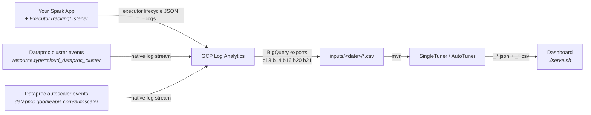
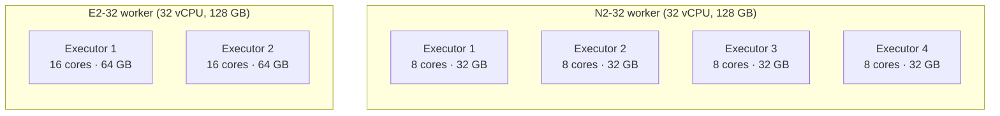
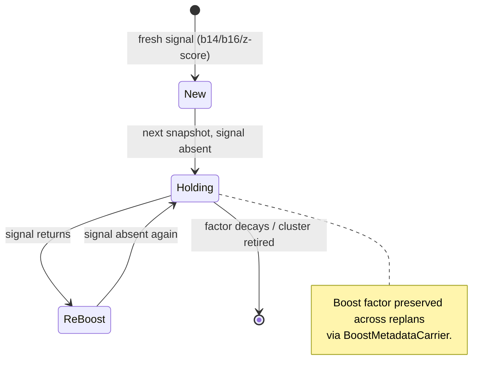

# SP-2 — OSS Landing Surface (README + Frontend Intro + Visuals + SQL Headers)

**Status:** Draft for review
**Date:** 2026-05-08
**Owner:** @albertols
**Sub-project of:** OSS Readiness epic (parent decomposition: SP-1 ✅ done & merged via PR #1; SP-2 this; SP-3 community infra; SP-4 Medium articles)
**Brainstorming state archive:** `docs/superpowers/specs/2026-05-08-sp2-brainstorm-state.md` (preserved for audit; do not edit going forward)

## Context

After SP-1 landed the build/quality foundation (Maven wrapper, ScalaTest+Scoverage, Spotless+scalafix, GitHub Actions CI+CodeQL, LICENSE, SECURITY.md, Dependabot), the project still presents to the world as a 286-byte README with three bullet links. SP-2 fixes that — building the landing surface that creates a great first impression for first-time visitors (Spark engineers on GCP Dataproc) and on-ramps OSS contributors.

SP-2's first-impression surfaces are two: the `README.md` rendered on GitHub, and a new browser-based landing page rendered by the existing `serve.sh`-driven dashboard. Per the user's stated constraint ("no README ↔ intro page misalignment"), both surfaces render the **same** Markdown source — README.md is the single source of truth, the landing fetches and renders it via marked.js + mermaid.js at runtime. The existing dashboard at `index.html` is renamed to `dashboard.html` and otherwise untouched (zero regression risk to the heavily-used UI).

## Goals

1. Replace the empty `README.md` with a ~450-line landing-surface README that lands the value within the first 200 words ("from raw BigQuery exports to optimised cluster config in 5 minutes"), tours 5 marquee features visually, and on-ramps contributors via deep links to existing design docs.
2. Add an `index.html` landing page at the frontend root that renders the SAME README content via marked.js + mermaid.js, framed by a designed CSS shell.
3. Author 3 Mermaid diagrams that work natively on GitHub AND in the landing (telemetry flow, job virtualization, boost lifecycle state machine).
4. Add structured header comments to the 5 Log Analytics SQL files (b13/b14/b16/b20/b21) that disambiguate `ExecutorTrackingListener`-driven vs GCP-native telemetry sources.
5. Add a `ROADMAP.md` skeleton with `[#TBD]` issue placeholders that SP-3 fills.
6. Zero perturbation to the existing dashboard; `./serve.sh` continues to serve it (now at `/dashboard.html` instead of `/`).

## Non-goals (deferred)

- Logo design (SP-3 candidate).
- `CONTRIBUTING.md`, issue templates, PR templates (SP-3 owns).
- Filling out the tracking GitHub Issues that ROADMAP.md links to (SP-3 fills).
- Code-block syntax highlighting in the landing (deferred — limited code surface in §7 doesn't yet earn it).
- Interactive elements in the landing beyond CTAs (no embedded dashboards, no demo iframes).
- TOC auto-generation in the landing (the README's `##` headings render as in-page anchors via marked.js; explicit TOC defers).
- Windows `serve.sh` portability (the `cp` path math + bash dependencies are macOS/Linux-supported only for now; SP-3 follow-up).
- Tightening DisableSyntax noReturns/noWhileLoops, Maven wrapper script-only upgrade, `.gitattributes` line-endings (already in SP-3 backlog from SP-1).

## Decisions (locked in during brainstorming)

| # | Decision | Choice | Rationale |
|---|---|---|---|
| Q1 | Inlining strategy | **Landing surface + deep links** | Existing `_*.md` docs (CLUSTER_TUNING, AUTO_TUNING, REFINEMENT, LOG_ANALYTICS) carry the depth. README owns the on-ramp. ~400-600 lines, not a wall of feature manuals. |
| Q2 | Single source of truth | **README.md is the source; landing renders via marked.js + mermaid.js at runtime; Mermaid for all diagrams (works on GitHub natively + via mermaid.js in the landing).** | Zero tooling. Single file to edit. GitHub renders the same Mermaid that the dashboard does. Strict no-misalignment constraint. |
| Q3 | Audience + tone | **Primary:** Spark engineers on GCP Dataproc. **Secondary:** OSS contributors. **Tone:** technically deep, opinionated, didactic — "smart Spark colleague over coffee." Real GCP prices, real boost factors, real cost deltas. **Length:** ~450 lines. **Promise:** "from raw BigQuery exports to optimised cluster config in 5 minutes" within first 200 words. |
| Q4 | README outline | **12 sections, locked** (table below). "Boosted Vitamins" framing threads through §3 + §5. |
| Q5 | Marquee features | **5 marquee features** in §5: boost lifecycle, z-score executor scale-up, trends, **Cost & Autoscaling Lens** (combined), statistical lens (Pearson). 5 OUT items have an explicit placement contract (table below) — must be honoured. |
| Q6 | Frontend integration | **New `index.html` at the frontend root for the landing; existing dashboard renamed to `dashboard.html`.** No dashboard code changes. |
| Q7 | Visual asset inventory | **5 PNGs** (already delivered by user under `docs/images/`) + **3 Mermaid** diagrams + **1 markdown table**. Logo deferred. |
| Q8 | SQL header scope | **Bundled into SP-2** with a structured template across all 5 files. |
| Q9 | Roadmap location | **Hybrid: short `ROADMAP.md` + linked GitHub Issues.** SP-2 lands the skeleton with `[#TBD]` placeholders; SP-3 writes the Issues. |
| Q10 | Routing | **Rename existing `index.html` → `dashboard.html`. New `index.html` is the landing.** "Already know this? Skip to dashboard →" escape hatch in landing header. |
| Q11 | README fetch mode | **`serve.sh` copies README + `docs/images/` into the served dir at startup.** Both copies gitignored. |

## README architecture (the 12 sections)

| # | Section | Word target | Visual asset | Content notes |
|---|---|---|---|---|
| 0 | **Hero block** | n/a | `docs/images/1_hero.png` | Title + one-line tagline + badge row (CI / Codecov / License Apache-2.0 / Scala 2.12 / Spark 3.5.3 / Dataproc) + the hero screenshot. |
| 1 | **The 5-minute promise** | 150 | text-only | Tiny code block showing the actual command sequence: export BigQuery queries to CSV → `./mvnw -Pserve package` → `./serve.sh` → open landing → click Skip to dashboard. |
| 2 | **Why does this exist?** | 200 | text-only | The pain (cluster sizing today is guesswork → over-provision burn OR 3am OOMs). The answer (data-driven from YOUR job history, not vendor heuristics). |
| 3 | **How it works (F1 telemetry + Boosted Vitamins)** | 300 | Mermaid diagrams A + B (telemetry flow, job virtualization) | Spotlight `ExecutorTrackingListener` as F1-style telemetry. Introduce the "Boosted Vitamins" naming for `bNN` files. Explicit one-liner: *"the diagnostics CSVs are named `bNN.csv` because they're the **vitamins** recipes take to get fit."* |
| 4 | **Dataproc Autoscaler vs Serverless** | 200 | Markdown comparison table | Capitalised correctly. "This optimises Autoscaler. NOT Serverless." Inline callout: **"Why you can't just 'let it scale'"** — IP/quota constraints (`/24 subnet caps you at ~250 IPs across all running clusters; an N2-32 vCPU quota of 100 caps your max executor count regardless of YARN demand`). |
| 5 | **Marquee features (the tour)** | 400 | 4 PNGs + 1 Mermaid | 5 features (table below). |
| 6 | **Quickstart — actually run it** | 150 | text-only | Static-CSV mode (drop CSVs in `inputs/<date>/`, run mvn) + dashboard-API mode (`./serve.sh --api`, follow the wizard) + sample data ships (`2099_01_01` / `2099_01_02`). Mention dashboard interactiveness ("click any cluster → drill to recipes → click any recipe → ref vs current configs side by side, every cell copyable"). |
| 7 | **Extending it** | 200 | text-only + 1 Scala code stub | `TuningStrategy` (how to write one + where it surfaces in `wizard.js`); `RefinementVitamin` (boost-lifecycle composition). Deep links to `_DESIGN.md`, `_AUTO_TUNING.md`, `_REFINEMENT.md`. Forward-ref from §5 #1: "boost behaviour is composable via `RefinementVitamin`s — see Extending it." |
| 8 | **Project status** | 50 | text-only | "Local-only today. GCP-deployable is SP-3 follow-up." Sets honest expectations. |
| 9 | **Roadmap** | link only | text-only | Links to `ROADMAP.md`. |
| 10 | **Contributing** | 50 | text-only | Brief guidance + a note that the full `CONTRIBUTING.md` lands in SP-3 (see open question 6 for handling). Always include: link to ROADMAP.md, link to LICENSE, "PRs welcome — see Roadmap for active work." |
| 11 | **Acknowledgements** | 30 | text-only | Spark, Scala, GCP Dataproc, BigQuery, Scallop, ScalaTest, Spotless, Scoverage, scalafix. |
| 12 | **License** | link | text-only | Apache-2.0 (already landed in SP-1). Link to `LICENSE`. |

**Total: ~1700 words / ~450 lines of Markdown after diagrams + images.**

### §5 — Marquee feature tour (5 features, locked)

Each feature: **one screenshot or Mermaid** + **one-liner promise** + **one-line "how it works"** + **deep link to a `_*.md` for full rationale.** ~80 words each.

| # | Feature | Asset | Deep links |
|---|---|---|---|
| 1 | **Boost lifecycle (b14 + b16)** — the "Vitamins" in action | Mermaid C (state machine) | `_REFINEMENT.md`, `_AUTO_TUNING.md` (BoostMetadataCarrier) |
| 2 | **Z-score executor SCALE-UP** — statistical detection of autoscaling-cap touch | `2_z-score-cap-touch.png` | `_REFINEMENT.md` (ExecutorScaleVitamin) |
| 3 | **Trends — Degraded / Improved / Stable / New / Dropped** | `3_trends.png` | `_AUTO_TUNING.md` (TrendDetector, StatisticalAnalysis) |
| 4 | **Cost & Autoscaling Lens** (combined slot per Q5 + Q7 update) — per-cluster, distribution, projection; with the actual scale events overlaid | `5_autoscaling.png` (the screenshot carries both annotations) | `_AUTO_TUNING.md` (PerformanceEvolver) |
| 5 | **Statistical Lens — Pearson on normalised covariances** | `6_pearson_correlation.png` | `_AUTO_TUNING.md` (StatisticalAnalysis) |

### §5 OUT-item placement contract (Q5; MUST honour when writing)

| OUT item | Lives at | What it looks like |
|---|---|---|
| **IP count + machine/cores quota** | §4 in a **"Why you can't just 'let it scale'"** callout block | "/24 subnet caps you at ~250 IPs across all running clusters; an N2-32 vCPU quota of 100 caps your max executor count regardless of YARN demand." Concrete numbers. |
| **ClusterConf + recipeSparkConf viz** | §5 #4 (Cost & Autoscaling Lens) second line + §6 dashboard tour | "Cost & Autoscaling Lens sits side-by-side with the actual `clusterConf` JSON and `recipeSparkConf` blocks per recipe — every value copyable, ref vs current diffed." |
| **P95 Job Duration / P95 Max Executors** | §5 #3 (Trends) AND #5 (Statistical Lens) — named as the metrics the math operates on | "Trends classify recipes on `p95_run_duration_ms` deltas; Statistical Lens runs Pearson on normalised covariances of `p95_run_max_executors / maxExecutors`." |
| **Frontend interactiveness** | §5 #4 (copyable values) + §6 (dashboard tour: "click any cluster → drill into recipes → click any recipe → ref vs current configs side by side") + §7 (architecture one-liner: "static-file dashboard with a small Java backend; every cell copyable, every cluster/recipe deep-linkable") | Multi-touch — never just an afterthought. |
| **TuningStrategies** | §7 primary home + forward-ref from §5 #1 | Code stub showing how to write a new strategy + where it surfaces in `wizard.js`. |

## Frontend landing architecture

### File layout after SP-2

```
src/main/scala/com/db/serna/orchestration/cluster_tuning/auto/frontend/
  index.html        NEW — landing (renders README via marked.js + mermaid.js)
  dashboard.html    RENAMED from index.html — dashboard untouched
  landing.css       NEW — CSS frame for the landing (~150 lines)
  app.js            UNCHANGED
  wizard.js         UNCHANGED
  tuner-api.js      AUDIT (see "tuner-api.js audit" below)
  style.css         UNCHANGED — dashboard styles isolated
  serve.sh          MODIFIED — copies README + docs/images at startup; updated default served file
  README.md         GITIGNORED — copied per serve boot
  docs/images/      GITIGNORED — copied per serve boot
```

### `index.html` (landing) — concrete

```html
<!DOCTYPE html>
<html lang="en">
<head>
  <meta charset="UTF-8">
  <meta name="viewport" content="width=device-width, initial-scale=1.0">
  <title>Spark Cluster Job Tuner — Cost-optimise GCP Dataproc</title>
  <link rel="stylesheet" href="landing.css">
  <script src="https://cdn.jsdelivr.net/npm/marked@13.0.3/marked.min.js"></script>
  <script src="https://cdn.jsdelivr.net/npm/mermaid@11.4.1/dist/mermaid.min.js"></script>
</head>
<body>
  <header class="landing-header">
    <span class="landing-title">Spark Cluster Job Tuner</span>
    <a class="skip-to-dashboard" href="dashboard.html">Already know this? Skip to dashboard →</a>
  </header>
  <main>
    <article id="readme" class="rendered-md">Loading…</article>
  </main>
  <footer class="landing-footer">
    <a href="https://github.com/albertols/spark-cluster-job-tuner">GitHub</a> ·
    <a href="dashboard.html">Open dashboard</a> ·
    <a href="ROADMAP.md">Roadmap</a>
  </footer>
  <script>
    const dark = window.matchMedia('(prefers-color-scheme: dark)').matches;
    mermaid.initialize({ startOnLoad: false, theme: dark ? 'dark' : 'default' });
    fetch('README.md')
      .then(r => r.ok ? r.text() : Promise.reject(`HTTP ${r.status}`))
      .then(md => {
        document.getElementById('readme').innerHTML = marked.parse(md);
        return mermaid.run({ querySelector: '.language-mermaid' });
      })
      .catch(e => {
        document.getElementById('readme').innerHTML =
          `<p>Failed to load README.md (${e}). Try restarting <code>./serve.sh</code>.</p>`;
      });
  </script>
</body>
</html>
```

### `landing.css` — design intent

- Max-width 880px main column, centred. Generous line-height (1.7).
- Monospace + light-bg for code blocks; no syntax highlighting (out of scope).
- Table styling for the §4 comparison matrix and SP-2's other tables (zebra rows, padded cells).
- Responsive at narrow widths (single column, smaller margins).
- Auto dark/light via `prefers-color-scheme`.
- Header sticky on scroll with the "Skip to dashboard →" CTA always visible.
- ~150 lines target. Not a CSS framework — plain handwritten.

### `serve.sh` modifications

Two changes:

1. **Copy README + `docs/images/` into the served dir at startup.** Use `git rev-parse --show-toplevel` (run from the script's own directory) to find the repo root robustly — do NOT count `../` levels.

   ```bash
   REPO_ROOT="$(git -C "$(dirname "$(realpath "${BASH_SOURCE[0]}")")" rev-parse --show-toplevel)"
   cp "$REPO_ROOT/README.md" "$SERVE_DIR/README.md"
   mkdir -p "$SERVE_DIR/docs/images"
   cp -R "$REPO_ROOT/docs/images/." "$SERVE_DIR/docs/images/"
   ```

   The copy step runs idempotently every `./serve.sh` boot; restarts pick up README edits.

2. **Audit any hardcoded `index.html` references** (notably the `--api` mode that opens the browser). Update to `dashboard.html` ONLY where the dashboard URL is intended; the new landing at `/` is fine for first-visit URLs.

### `tuner-api.js` audit

Search the file for occurrences of `index.html`. If found and they refer to dashboard URL construction, update to `dashboard.html`. Document any remaining occurrences (e.g. comments) without changing them.

### `.gitignore` additions

```
# Landing-page copies (regenerated on serve boot)
src/main/scala/com/db/serna/orchestration/cluster_tuning/auto/frontend/README.md
src/main/scala/com/db/serna/orchestration/cluster_tuning/auto/frontend/docs/images/
```

These ignore the **copies** in the served directory; the canonical `README.md` at repo root and `docs/images/` are NOT gitignored.

## The 3 Mermaid diagrams (concrete sources)

### Diagram A — §3 Telemetry flow



### Diagram B — §3 Job virtualization within a Dataproc node

Two side-by-side `flowchart TB` blocks — one for **N2-32** (4×8c executors), one for **E2-32** (2×16c executors):



**Fallback:** if Mermaid's text-block rendering looks weak (the boxes don't visually communicate "blocks fit inside a worker"), fall back to **inline HTML+CSS** with two `<div class="node-vis">` blocks of explicit visual rectangles. The plan-write step will encode both branches; we pick at implementation time after seeing how Mermaid renders on GitHub.

### Diagram C — §5 #1 Boost lifecycle state machine



## SQL header comment template + per-file content

Standard 6-line block at the top of each `bNN_*.sql`, replacing or augmenting any existing comment:

```sql
-- =============================================================================
-- bNN_<purpose>.sql
--
-- Purpose:    <one-line role in the tuning pipeline>
-- Telemetry:  <GCP-native | ExecutorTrackingListener | both>
-- GCP source: <log filter, e.g. resource.type='cloud_dataproc_cluster'>
-- App source: <ExecutorTrackingListener event_type, or n/a>
-- Consumed:   <which Scala loader reads this CSV>
-- =============================================================================
```

Per-file content:

| File | Purpose | Telemetry | GCP source | App source | Consumed |
|---|---|---|---|---|---|
| **b13_recommendations_inputs_per_recipe_per_cluster.sql** | Per-recipe / per-cluster metrics for the tuner (avg, p95, durations, executors) | both | `resource.type='cloud_dataproc_cluster'` | `ExecutorTrackingListener` (executor lifecycle events) | `ClusterMachineAndRecipeTuner.parseB13Csv` *(to-verify against current code at plan time)* |
| **b14_clusters_with_nonzero_exit_codes.sql** | Driver-eviction detection (cluster-level signal) | GCP-native | `resource.type='cloud_dataproc_cluster'` | n/a | `ClusterDiagnostics.parseB14Csv` *(to-verify)* |
| **b16_oom_job_driver_exceptions.sql** | Driver-OOM correlation for heap-boost vitamin | both | `resource.type='cloud_dataproc_cluster'` (cluster events) | `ExecutorTrackingListener` (driver OOM event correlation) | `ClusterDiagnostics.parseB16Csv` *(to-verify)* |
| **b20_cluster_span_time.sql** | Cluster lifetime / span (from-to timestamps for per-recipe attribution) | GCP-native | `resource.type='cloud_dataproc_cluster'` | n/a | `ClusterMachineAndRecipeTuner.parseB20Csv` *(to-verify)* |
| **b21_cluster_autoscaler_values.sql** | Autoscaler scale events (`min/max` executors over time) | GCP-native | `dataproc.googleapis.com/autoscaler` | n/a | `ClusterMachineAndRecipeTuner.parseB21Csv` *(to-verify)* |

**`Consumed:` lines must be verified against current code at plan-write time** — the loader names above are best-guess, will be replaced with actual class/method names.

The header block is added **above** the existing SQL comments (which describe filters and projections); the existing content stays.

## ROADMAP.md skeleton

```markdown
# Roadmap

## Active sub-projects (OSS readiness epic)

- ✅ SP-1 — Build & Quality Hardening ([PR #1](https://github.com/albertols/spark-cluster-job-tuner/pull/1))
- 🟡 SP-2 — OSS Landing Surface (this PR)
- ⬜ SP-3 — Community Infra (CONTRIBUTING + issue templates + kickoff issues for C1/C2/C3)
- ⬜ SP-4 — Medium articles (PART_1, PART_2, PART_4)

## Major initiatives (proposed; SP-3 will fill the linked Issues)

### C1 — GCP-deployable [#TBD]

Fetch `b*.csv` exports automatically from BigQuery (schedule + on-demand). Deploy the frontend + a small backend on Cloud Run / App Engine. Cache CSV / JSON outputs in GCS. Manage with Terraform.

### C2 — Specialised agents [#TBD]

Three agent personas:

- **Agent 1 — Tuner Proposal**: pure metrics + groomed trends (covariances, correlations, z-score, etc.) at recipe + cluster level. Emits structured tuning-recommendation reports.
- **Agent 2 — L3 Spark Job Optimiser**: deep job-level optimisation suggestions (shuffle, caching, parallelism) using `ExecutorTrackingListener` evolution and Spark internal APIs. Inspired by Databricks Optimiser-style tooling.
- **Agent 3 — L2 PRD Failure Analyst**: analyses failed PRD jobs (`BQ.EXECUTION_TABLES` → logs → actions). Talks to Agents 1 + 2 (e.g., performance degradation → OOM crash chain).

A2A protocol, ADK on GCP, security guardrails (least-privilege Service Accounts), wrappers for BQ / GCS access.

### C3 — Markov chains for predictions [#TBD]

State-transition prediction of future cluster/job state from current + historical data. Scenario simulation: assess the impact of different tuning strategies on performance + cost. Matrix of states from observed log-analytics signals.

## Smaller follow-ups (already tracked in SP-1's plan doc)

- Tighten `DisableSyntax` rules — re-enable `noReturns` + `noWhileLoops` after refactoring 86 returns + 24 while-loops in production code [#TBD]
- Rename `serve` profile's `scala-test-compile` execution id to avoid Maven's merge-by-id override [#TBD]
- Maven wrapper script-only flavour (drop the bundled 50KB jar) [#TBD]
- `.gitattributes` for `mvnw` / `mvnw.cmd` line endings (Windows protection) [#TBD]
- Maven Central publishing pipeline (Sonatype + GPG) [#TBD]
- Coverage no-regression gate on PRs (currently report-only) [#TBD]
- Branch protection rules for `main` (currently relies on review discipline) [#TBD]
- Logo / brand identity [#TBD]
- Drop the orphaned `arr(...)` expression on `GenerationSummary.scala:146` [#TBD]
- `serve.sh` Windows portability (cp + bash dependencies) [#TBD]
- `index.html` landing: code-block syntax highlighting (highlight.js or prism.js) [#TBD]
```

## Rollout sequence (8 commits)

Each commit independently reviewable; each leaves the project in a working state.

1. **Rename `index.html` → `dashboard.html`** + audit `serve.sh` and `tuner-api.js` for `index.html` references (update only dashboard-URL ones to `dashboard.html`). **Verification:** `./serve.sh` boots, dashboard loads at `localhost:8080/dashboard.html`.
2. **Add `index.html` (landing) + `landing.css`** with marked.js + mermaid.js wiring. README still 286-byte stub at this point — the landing renders the stub. **Verification:** `localhost:8080/` shows the landing frame; "Skip to dashboard →" works.
3. **Modify `serve.sh`** to copy README + `docs/images/` at startup. Update `.gitignore` to ignore the copies in the served dir. **Verification:** restart serve, `localhost:8080/README.md` returns the (current) repo README; the copies appear under the served dir but `git status` shows no new tracked files.
4. **Stage 5 PNGs under `docs/images/`** (`git add docs/images/*.png` — already in working tree as staged). **Verification:** `git ls-files docs/images/` lists all 5 PNGs.
5. **Rewrite `README.md`** — all 12 sections, text + PNG image references, NO Mermaid yet. Place all OUT items per the Q5 contract. **Verification:** open as draft PR — GitHub Markdown preview is correct; landing renders all 5 PNGs.
6. **Add 3 Mermaid diagrams to README** (telemetry flow, job virtualization, boost-lifecycle). **Verification:** GitHub renders all 3 natively; landing renders all 3 via mermaid.js. If diagram B looks weak, fall back to inline HTML+CSS within this commit.
7. **SQL header comments** — 5 files (b13/b14/b16/b20/b21), structured 6-line template + per-file content. Verify the `Consumed:` loader names against current Scala code before committing. **Verification:** SQL files still well-formed; visual scan confirms template consistency.
8. **`ROADMAP.md` skeleton** — 3 sections (Active sub-projects / Major initiatives / Smaller follow-ups) with `[#TBD]` placeholders. **Verification:** Markdown parses; placeholder links are obvious.

## Verification gates (must pass before SP-2 PR opens)

1. `./mvnw -B verify` succeeds — regression check (no Scala/Maven changes expected).
2. `./serve.sh` boots cleanly. `localhost:8080/dashboard.html` shows the existing dashboard with all sample-data tabs working.
3. `localhost:8080/` shows the landing with: rendered README, all 5 PNGs visible, all 3 Mermaid diagrams rendering as SVGs.
4. README on GitHub (visible via draft PR preview): all 3 Mermaid diagrams render natively, all 5 PNGs render via relative paths.
5. All deep links in README resolve to existing `_*.md` files (no 404s on a draft PR).
6. `ROADMAP.md` parses as Markdown; placeholder `[#TBD]` links are visually obvious as placeholders.
7. SQL files still parse (visual scan; no SQL-runtime impact).
8. Landing renders correctly on a narrow viewport (375px wide — iPhone equivalent).
9. "Skip to dashboard →" link works (returns to dashboard).
10. Hard refresh on landing while serve.sh is stopped shows the graceful error message ("Failed to load README.md…"), not a blank page.

## Risks

- **Mermaid GitHub rendering quirks** — GitHub uses a server-side Mermaid version that may differ from `mermaid@11.4.1` we ship in the landing. **Mitigation:** test on a draft PR before final merge; avoid `mermaid v11`-only syntax where possible; if a diagram fails on GitHub, downgrade to syntax that works on both.
- **Marked.js XSS surface** — README is repo-controlled content, so risk is low; however, marked v13 sanitises by default. **Mitigation:** spec notes this; if README content ever includes user-submitted snippets, add explicit `DOMPurify` wrap.
- **`docs/images/` path resolution differences** — GitHub renders `` as `https://github.com/.../raw/main/docs/images/x.png`; landing renders it as `/docs/images/x.png`. Both work as long as we use relative paths (NOT leading slash) in markdown. **Mitigation:** lint-style check that all `` paths in README are relative; spec encodes this.
- **`serve.sh` `cp` portability** — works on macOS/Linux; Windows would need `xcopy` or PowerShell. **Mitigation:** SP-2 supports macOS/Linux; Windows portability is a SP-3 follow-up (already added to ROADMAP).
- **Mermaid theme on dark mode** — default Mermaid theme has poor contrast on dark backgrounds. **Mitigation:** detect `prefers-color-scheme: dark` in the landing and pass `theme: 'dark'` to mermaid.initialize (already encoded in the `index.html` skeleton above).
- **`serve.sh` `--api` mode opening `index.html` automatically** — the existing `--api` flow may auto-open `localhost:8080/`, which now hits the landing instead of the dashboard. First-impression: the user sees the landing on every API boot. **Mitigation:** if `--api` is intended for "open dashboard for power users," update its auto-open URL to `/dashboard.html`. Decide at plan-write time after auditing the actual `serve.sh --api` flow.
- **CDN unavailability** — marked.js + mermaid.js are loaded from `cdn.jsdelivr.net`. Offline / firewalled networks fail. **Mitigation:** spec notes this; SP-3 candidate to vendor the JS files locally (small follow-up).

## Dependencies on other sub-projects

- **SP-1 (already merged):** SP-2 consumes the badge URLs (CI / Codecov / License) for the §0 hero block. SP-1's merge unblocked SP-2.
- **SP-3 (community infra):** picks up the deferred items (CONTRIBUTING.md, issue templates, the actual GitHub Issues that ROADMAP.md links to via `[#TBD]`, logo design).
- **SP-4 (Medium articles):** consumes SP-2's diagrams + screenshots as visual material; SP-2 must land before SP-4 starts drafting.

## Open questions (resolve at plan-write time)

1. **`serve.sh --api` auto-open URL** — does it currently auto-open `localhost:8080/` or is it manual? Audit and decide whether to bump the auto-open to `/dashboard.html`.
2. **Diagram B Mermaid vs HTML+CSS fallback** — try Mermaid first, fall back if visual quality is insufficient. Plan encodes both branches.
3. **`Consumed:` loader names in SQL headers** — placeholder names (`ClusterMachineAndRecipeTuner.parseB13Csv` etc.) need verification against current code. Plan-write step does this verification.
4. **`docs/images/` copy timing in `serve.sh`** — should the copy happen on every boot, or be cached based on mtime? For now: every boot (simpler, cheap — 5 PNGs ≈ 600KB). Re-evaluate if it adds noticeable boot latency.
5. **README.md commit ordering** — the rollout sequence builds the README incrementally (text → images → mermaid). Could collapse into one commit if the user prefers; current 3-commit shape is for reviewability.
6. **§10 CONTRIBUTING.md handling** — `CONTRIBUTING.md` lands in SP-3, but SP-2's README §10 references it. Two options: (a) write §10 with a stub link to a `CONTRIBUTING.md` that SP-3 will create later (results in a temporary broken link from SP-2 merge until SP-3 merge); (b) write §10 as inline mini-guidance (PRs welcome, see Roadmap, LICENSE) and let SP-3 either expand it or extract to a real CONTRIBUTING.md. Recommendation: **(b)** for SP-2 to avoid a broken link, with SP-3 free to refactor.
