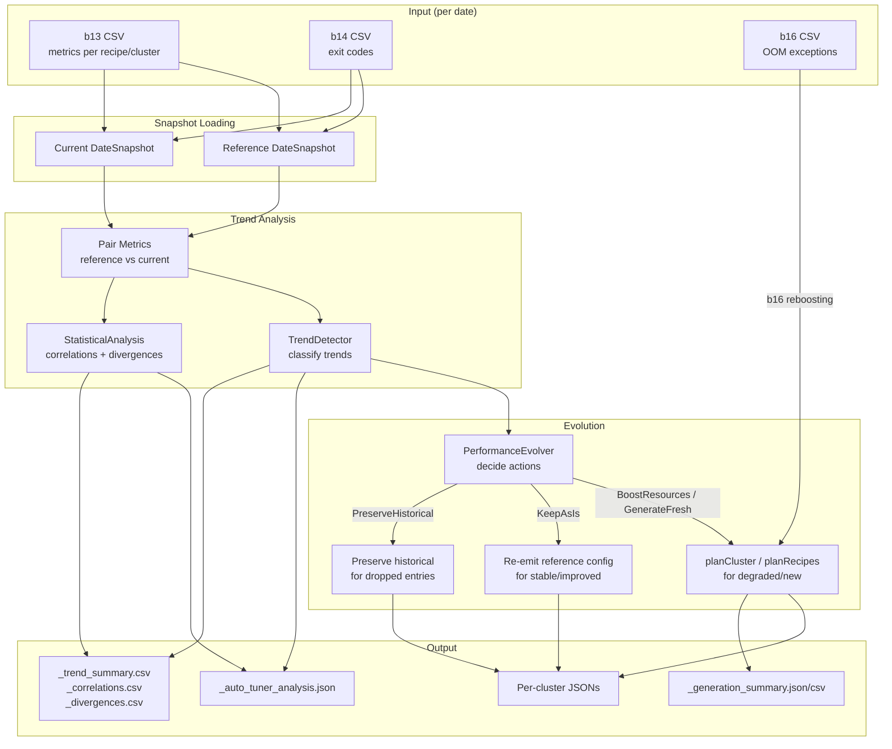

# Auto-Tuning: Multi-Date Performance Evolution

## Overview

The **Auto-Tuner** (`ClusterMachineAndRecipeAutoTuner`) extends the one-off tuner with **temporal awareness**. Instead of producing configurations from a single date's metrics, it compares metrics across at least two dates (**reference** and **current**) to:

1. Detect whether performance has **improved**, **degraded**, or remained **stable**
2. **Evolve** cluster and recipe configurations based on detected trends
3. **Preserve** historical configurations for clusters/recipes absent from current metrics
4. Produce **statistical analysis** (correlations, divergences) for deeper insight
5. Output **frontend-ready JSON** for interactive visualization

### One-Off Tuner vs Auto-Tuner

| Aspect | One-Off Tuner | Auto-Tuner |
|---|---|---|
| Input dates | 1 date | 2+ dates (reference + current) |
| Decision basis | Absolute metric values | Metric deltas across dates |
| Config evolution | Fresh plan every run | Keep/boost/preserve based on trend |
| b14 handling | Single-date eviction detection | Persistent eviction detection (both dates) |
| b16 handling | Separate refinement step | Integrated reboosting for degraded recipes |
| Output | Per-cluster JSONs + summaries | Same + analysis JSON/CSVs |

---

## Data Flow



---

## Performance Trend Analysis

### Classification Logic

For each paired (cluster, recipe), the `TrendDetector` computes deltas across all metrics and classifies the trend:

| Condition | Classification |
|---|---|
| p95 duration increased > 10% | **Degraded** |
| fraction_reaching_cap increased > 15% (and > 0) | **Degraded** |
| p95 duration decreased > 5% AND cap-hit not worsened | **Improved** |
| Within noise bands | **Stable** |
| Only in current date | **NewEntry** |
| Only in reference date | **DroppedEntry** |

### Confidence Level

Confidence is based on the minimum run count between both dates:

```
confidence = min(1.0, min(ref.runs, cur.runs) / 10.0)
```

| Min runs | Confidence |
|---|---|
| 1 | 0.1 |
| 5 | 0.5 |
| 10+ | 1.0 |

### Metrics Tracked

| Metric | Source | What it measures |
|---|---|---|
| avg_executors_per_job | b13 | Average parallelism |
| p95_run_max_executors | b13 | Peak resource demand |
| avg_job_duration_ms | b13 | Average job latency |
| p95_job_duration_ms | b13 | Tail latency (P95) |
| fraction_reaching_cap | b13 | Capacity pressure |
| runs | b13 | Workload volume |

---

## Evolution Logic

### Decision Table

| Trend | Action | What happens |
|---|---|---|
| Improved | KeepAsIs | Reference config emitted unchanged |
| Degraded | BoostResources | Re-plan with current metrics; apply b16 reboosting if OOM signals exist |
| Stable | KeepAsIs | Reference config emitted unchanged |
| NewEntry | GenerateFresh | Plan from scratch with current metrics |
| DroppedEntry (keep=true) | PreserveHistorical | Reference config emitted unchanged |
| DroppedEntry (keep=false) | Skip | No output |

### KeepAsIs / PreserveHistorical

Reference output JSONs are read via `SimpleJsonParser` and re-emitted verbatim. This ensures exact config preservation with no floating-point drift from re-computation.

### BoostResources

1. `planCluster()` is called with current-date metrics (naturally produces larger allocations for higher metric values)
2. `planManualRecipes()` / `planDARecipes()` generate recipe configs
3. If b16 OOM signals exist for this cluster, `MemoryHeapBoostVitamin` is applied with `--b16-reboosting-factor`
4. If b14 driver eviction persists in both dates, master machine is promoted to a more powerful type

---

## Statistical Analysis

### Correlation Analysis

Pearson correlations are computed between metric delta pairs across the entire fleet:

| Metric A (delta) | Metric B (delta) | What it reveals |
|---|---|---|
| p95_run_max_executors | p95_job_duration_ms | Peak resource vs tail latency |
| avg_executors_per_job | avg_job_duration_ms | Resource consumption vs avg latency |
| fraction_reaching_cap | p95_job_duration_ms | Capacity pressure vs tail latency |
| runs | avg_job_duration_ms | Workload volume vs latency |

**Interpretation:**
- Pearson near **+1.0**: metrics move together (e.g., more executors correlate with longer duration = possible inefficiency)
- Pearson near **-1.0**: metrics move inversely (e.g., more executors correlate with shorter duration = scaling helps)
- Pearson near **0.0**: no linear relationship

### Divergence Detection

For each metric, the auto-tuner computes the fleet-wide mean and standard deviation of deltas, then flags (cluster, recipe) pairs whose z-score exceeds the threshold (default: 2.0).

These outliers represent recipes whose behavior differs significantly from the fleet average -- they may need special attention or investigation.

---

## CLI Usage

```bash
# Basic usage
main(Array("--reference-date=2025_12_20", "--current-date=2026_04_15"))

# With custom strategy and reboosting factor
main(Array("--reference-date=2025_12_20", "--current-date=2026_04_15",
           "--strategy=cost_biased", "--b16-reboosting-factor=2.0"))

# Disable historical preservation
main(Array("--reference-date=2025_12_20", "--current-date=2026_04_15",
           "--keep-historical-tuning=false"))

# Custom divergence threshold
main(Array("--reference-date=2025_12_20", "--current-date=2026_04_15",
           "--divergence-z-threshold=3.0"))
```

### CLI Arguments

| Argument | Default | Description |
|---|---|---|
| `--reference-date` | (required) | Reference date in YYYY_MM_DD format |
| `--current-date` | (required) | Current date in YYYY_MM_DD format |
| `--keep-historical-tuning` | true | Preserve configs for absent clusters/recipes |
| `--b16-reboosting-factor` | 1.5 | Memory boost factor for b16 OOM signals |
| `--b17-reboosting-factor` | 1.0 | Memory overhead boost (future, no-op at 1.0) |
| `--strategy` | default | Tuning strategy: default, cost_biased, performance_biased |
| `--divergence-z-threshold` | 2.0 | Z-score threshold for outlier detection |

---

## Output Files

All outputs are written to `outputs/<current_date>_auto_tuned/`:

| File | Description |
|---|---|
| `<cluster>-manually-tuned.json` | Per-cluster manual config (same format as one-off tuner) |
| `<cluster>-auto-scale-tuned.json` | Per-cluster DA config (same format as one-off tuner) |
| `_auto_tuner_analysis.json` | Fleet-wide analysis (frontend-ready) |
| `_trend_summary.csv` | Per-(cluster, recipe) trend, confidence, action |
| `_correlations.csv` | Metric correlation matrix |
| `_divergences.csv` | Outlier recipes with z-scores |
| `_generation_summary.json` | Quota tracking and strategy metadata |
| `_generation_summary.csv` | Same as above in CSV format |

### Analysis JSON Schema

```json
{
  "metadata": {
    "generated_at": "ISO-8601 timestamp",
    "reference_date": "YYYY_MM_DD",
    "current_date": "YYYY_MM_DD",
    "total_clusters": 150,
    "total_recipes": 800,
    "strategy": "default"
  },
  "trends_summary": {
    "improved": 45,
    "degraded": 12,
    "stable": 88,
    "new_entries": 3,
    "dropped_entries": 2
  },
  "cluster_trends": [
    {
      "cluster": "cluster-wf-...",
      "overall_trend": "degraded|improved|stable|mixed",
      "recipes": [
        {
          "recipe": "_ETL_m_....json",
          "trend": "degraded",
          "confidence": 0.85,
          "action": "boost_resources",
          "reason": "p95_job_duration_ms changed 23.4%",
          "deltas": [
            {
              "metric": "p95_job_duration_ms",
              "reference": 120000,
              "current": 148000,
              "pct_change": 23.3
            }
          ]
        }
      ]
    }
  ],
  "correlations": [
    {
      "metric_a": "delta_p95_run_max_executors",
      "metric_b": "delta_p95_job_duration_ms",
      "pearson": 0.72,
      "covariance": 15234.5,
      "n": 800
    }
  ],
  "divergences": [
    {
      "cluster": "cluster-x",
      "recipe": "recipe.json",
      "metric": "delta_p95_job_duration_ms",
      "reference": 100000,
      "current": 500000,
      "z_score": 3.2,
      "is_outlier": true
    }
  ]
}
```

---

## Source Files

```
auto/
  AutoTunerModels.scala                     # Domain models (DateSnapshot, MetricsPair, trends, etc.)
  StatisticalAnalysis.scala                 # Pure math (mean, stddev, covariance, Pearson, z-score)
  TrendDetector.scala                       # Trend classification with configurable thresholds
  PerformanceEvolver.scala                  # Evolution decision logic (trend -> action)
  AutoTunerJsonOutput.scala                 # Analysis JSON/CSV output generation
  ClusterMachineAndRecipeAutoTuner.scala    # Main entry point (Scallop CLI + run())
  _AUTO_TUNING.md                           # This documentation
```

---

## Future Tasks

### Not Yet Implemented

1. **b17 memoryOverhead reboosting** -- `--b17-reboosting-factor` CLI arg is defined but no-op at 1.0. Requires b17 SQL query and corresponding `MemoryOverheadBoostVitamin` in the refinement module.

2. **Multi-date trends (>2 dates)** -- Currently compares exactly 2 dates. Future: accept N date directories, compute regression lines / moving averages across all dates, detect acceleration/deceleration patterns.

3. **Resource decrease for sustained improvement** -- Currently `Improved` keeps configs as-is. Future: if improvement is sustained across 3+ dates, slightly decrease resources (executor memory, worker count) to save cost.

4. **Temporal fine-grained analysis** -- Current metrics are aggregated over the full time range. Future: break down by job stage, time-of-day, or concurrent job windows to understand peak behavior more precisely (e.g., max concurrent jobs at specific times).

5. **ML-based predictive tuning** -- Use historical trends to predict future resource needs and proactively adjust configurations before degradation occurs.

6. **Frontend evolution** -- Multi-date timeline slider, cost projection charts, what-if scenario simulator, config diff viewer.

7. **b17 SQL query** -- Design and implement `b17_oom_memory_overhead_exceptions.sql` to detect `OutOfMemoryError: Direct buffer memory` and container-killed-by-YARN patterns that indicate memoryOverhead pressure.

8. **Cost-aware evolution** -- When boosting resources for degraded recipes, consider the cost impact and apply a cost ceiling to prevent unbounded resource growth.

9. **Cluster-level trend aggregation** -- Currently trends are per-(cluster, recipe). Future: aggregate to cluster level to decide whether the entire cluster shape needs evolution.

10. **Confidence-weighted decisions** -- Low-confidence trends (few runs) could use different thresholds or require confirmation across multiple dates before triggering evolution.
