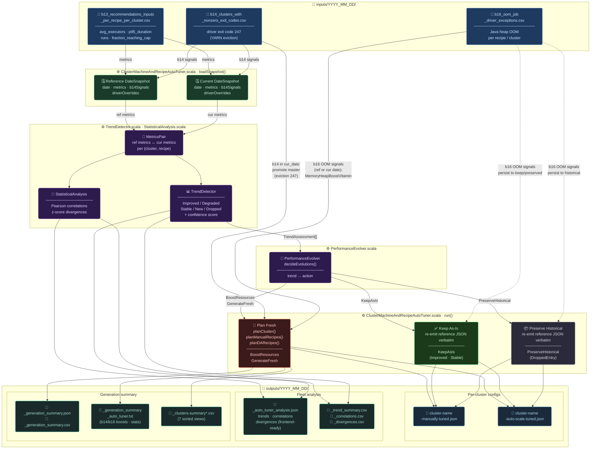

/# Auto-Tuning: Multi-Date Performance Evolution

## Overview

The **Auto-Tuner** (`ClusterMachineAndRecipeAutoTuner`) extends the one-off tuner with **temporal awareness**. Instead of producing configurations from a single date's metrics, it compares metrics across at least two dates (**reference** and **current**) to:

1. Detect whether performance has **improved**, **degraded**, or remained **stable**
2. **Evolve** cluster and recipe configurations based on detected trends
3. **Preserve** historical configurations for clusters/recipes absent from current metrics
4. Produce **statistical analysis** (correlations, divergences) for deeper insight
5. Output **frontend-ready JSON** for interactive visualization

### One-Off Tuner vs Auto-Tuner

| Aspect | One-Off Tuner | Auto-Tuner |
|---|---|---|
| Input dates | 1 date | 2+ dates (reference + current) |
| Decision basis | Absolute metric values | Metric deltas across dates |
| Config evolution | Fresh plan every run | Keep/boost/preserve based on trend |
| b14 handling | Single-date eviction detection | Persistent eviction detection (both dates) |
| b16 handling | Separate refinement step (via `ClusterMachineAndRecipeTunerRefinement`) | Integrated reboosting for ALL evolution paths, with `New / ReBoost / Holding` lifecycle that compounds across runs |
| b16 boost across re-plans | n/a | `BoostMetadataCarrier` carries prior factor + boosted memory into freshly-replanned configs so the boost survives `BoostResources`/`GenerateFresh` |
| Z-score executor scale-up | n/a | `ExecutorScaleVitamin` raises `spark.dynamicAllocation.maxExecutors` for paired duration outliers that are cap-touching |
| Output | Per-cluster JSONs + summaries | Same + `_auto_tuner_analysis.json`, `_correlations.csv`, `_divergences.csv`, `_trend_summary.csv`, structured `boost_groups` in `_generation_summary_auto_tuner.json` |

---

## Data Flow



---

## Performance Trend Analysis

### Classification Logic

For each paired (cluster, recipe), the `TrendDetector` computes deltas across all metrics and classifies the trend:

| Condition | Classification |
|---|---|
| p95 duration increased > 10% | **Degraded** |
| fraction_reaching_cap increased > 15% (and > 0) | **Degraded** |
| p95 duration decreased > 5% AND cap-hit not worsened | **Improved** |
| Within noise bands | **Stable** |
| Only in current date | **NewEntry** |
| Only in reference date | **DroppedEntry** |

### Confidence Level

Confidence is based on the minimum run count between both dates:

```
confidence = min(1.0, min(ref.runs, cur.runs) / 10.0)
```

| Min runs | Confidence |
|---|---|
| 1 | 0.1 |
| 5 | 0.5 |
| 10+ | 1.0 |

### Metrics Tracked

| Metric | Source | What it measures |
|---|---|---|
| avg_executors_per_job | b13 | Average parallelism |
| p95_run_max_executors | b13 | Peak resource demand |
| avg_job_duration_ms | b13 | Average job latency |
| p95_job_duration_ms | b13 | Tail latency (P95) |
| fraction_reaching_cap | b13 | Capacity pressure |
| runs | b13 | Workload volume |

---

## Evolution Logic

### Decision Table

| Trend | Action | What happens |
|---|---|---|
| Improved | KeepAsIs | Reference config emitted verbatim; b16 reboost (Holding/ReBoost) + executor scale-up (Holding/ReBoost) applied on top |
| Degraded | BoostResources | Re-plan with current metrics; `BoostMetadataCarrier` carries prior b16 metadata; b16 reboost (New/ReBoost/Holding) + executor scale-up applied |
| Stable | KeepAsIs | Reference config emitted verbatim; same on-top steps as Improved |
| NewEntry | GenerateFresh | Plan from scratch with current metrics; carry has nothing to copy (no prior boost); b16 may still fire `New`. **Executor scale-up explicitly skips new entries.** |
| DroppedEntry (keep=true) | PreserveHistorical | Reference config emitted verbatim with `lastTunedDate` + `keptWithoutCurrentDate: true`; b16 + executor-scale Holding states preserve any prior boosts |
| DroppedEntry (keep=false) | Skip | No output |

### b16 OOM Reboosting Persistence

b16 reboosting is applied to **all evolution paths** (KeepAsIs, BoostResources, GenerateFresh, PreserveHistorical), not just degraded recipes. The auto-tuner searches for b16 CSVs in both `current_date` and `reference_date` input directories. If OOM signals existed in reference_date but the b16 CSV is absent in current_date, the boost still persists — removing it would risk regression into OOM failures.

`MemoryHeapBoostVitamin` uses the date-aware 3-arg `computeBoosts` overload that produces one of three states per recipe:

| State | Trigger | What happens |
|---|---|---|
| `New` | recipe has no `appliedMemoryHeapBoostFactor` tag AND a fresh signal in current_date | first-time boost — `spark.executor.memory` × factor (default 1.5), totals re-derived, factor stamped |
| `ReBoost` | recipe already tagged AND a fresh signal in current_date | boost stacks on top of the already-boosted memory; cumulative factor = `prior × factor` (e.g. 1.5 → 2.25 → 3.375) |
| `Holding` | recipe already tagged AND no fresh signal in current_date | memory and totals preserved; factor preserved; the boost is succeeding so don't roll it back |

The cumulative factor lives in `extraFields["appliedMemoryHeapBoostFactor"]` on the recipe and round-trips through `SimpleJsonParser`.

### B16 boost compounding across re-plans (`BoostMetadataCarrier`)

When the cluster's primary action is `BoostResources` or `GenerateFresh`, the AutoTuner re-plans from scratch — the freshly emitted JSON has baseline memory and **no** `appliedMemoryHeapBoostFactor` tag. Without intervention, the downstream `applyB16Reboosting` step would either:

- treat the recipe as untagged and fire a `New` boost (cumulative factor reset to 1.5), OR
- not boost at all if the b16 CSV no longer reports the recipe (boost silently lost).

`BoostMetadataCarrier.injectPriorBoosts(curJson, refJson, recipeNames)` runs **after** `mergePreservedRecipesIntoOutputs` and **before** `applyB16Reboosting`. For each recipe whose REF output JSON carries `appliedMemoryHeapBoostFactor`, it copies into the freshly-emitted CUR JSON:

- `appliedMemoryHeapBoostFactor` (the cumulative factor)
- `spark.executor.memory` (the boosted GB string, e.g. `"12g"`)
- `total_executor_minimum_allocated_memory_gb` and `total_executor_maximum_allocated_memory_gb` re-derived from the CUR recipe's `min/maxExecutors × boostedMemGb`

The carrier is pure raw-JSON surgery (companion to `KeptRecipeCarrier`), so fields the lightweight `SimpleJsonParser` doesn't understand (e.g. nested `cost_timeline` arrays) are left untouched. **Anchored on the recipe key**, not block contents — two sibling baseline-planned recipes can have byte-identical inner blocks, so a naïve `indexOf` would patch the wrong one.

After the carry, `applyB16Reboosting` sees `priorFactor=Some(1.5)` and routes the recipe into `ReBoost` (fresh signal in cur b16) or `Holding` (no fresh signal) — the boost compounds OR holds, but never silently regresses.

### Z-score-driven executor scale-up (`ExecutorScaleVitamin`)

The AutoTuner's divergence detector flags duration outliers in the current snapshot — recipes whose `avg_job_duration_ms` / `p95_job_duration_ms` z-score crosses the threshold. Until now these were observation-only. `ExecutorScaleVitamin` makes the AutoTuner act on its own divergence output and bump the autoscaling ceiling.

**Selection rule** (all must hold for a fresh signal):

- `metricName ∈ { p95_job_duration_ms, avg_job_duration_ms }`
- `zScore >= --scale-z-threshold` (default `3.0`)
- `isOutlier == true`
- `isNewEntry == false` — **NEW entries are never auto-scaled** (their fresh plan already sized executors based on cur metrics)
- Cap-touching: `p95_run_max_executors / current maxExecutors >= --scale-cap-touch-ratio` (default `0.5`)

**Effect** (DA recipes only — manual recipes with `spark.executor.instances` are skipped):

- `spark.dynamicAllocation.maxExecutors` × factor (default `1.5`, ceil-rounded, with a `+1` floor)
- `total_executor_maximum_allocated_memory_gb` re-derived as `boostedMaxExecutors × memGb`
- `appliedExecutorScaleFactor` stamped on the recipe (round-trips through `SimpleJsonParser`)
- **`minExecutors` is intentionally untouched** — the goal is headroom, not a higher floor (cold-start cost stays the same)

Lifecycle is identical to b16: a recipe scaled in a prior run that no longer triggers the rule moves to `Holding`; one that still triggers re-fires as `ReBoost` and the cumulative factor compounds.

Disable with `--executor-scale-factor=1.0`.

### KeepAsIs / PreserveHistorical

Reference output JSONs are read via `SimpleJsonParser` and re-emitted verbatim. This ensures exact config preservation with no floating-point drift from re-computation. After re-emission, b16 reboosting is applied if OOM signals are present in either date.

### BoostResources / GenerateFresh — full step order

1. `planCluster()` is called with current-date metrics (naturally produces larger allocations for higher metric values)
2. `planManualRecipes()` / `planDARecipes()` generate recipe configs; freshly emitted JSON has baseline memory and no boost tags
3. `injectClusterConfTag(applied_driver_promotion)` if a b14 master promotion was decided
4. `mergePreservedRecipesIntoOutputs` carries `preserve_historical` recipe blocks (with `lastTunedDate` + `keptWithoutCurrentDate`) from the reference output
5. **`carryPriorBoostMetadata`** (`BoostMetadataCarrier`) — copies `appliedMemoryHeapBoostFactor` + boosted `spark.executor.memory` + re-derived totals from REF output into CUR output (per-recipe, anchored by name)
6. `applyB16Reboosting` — fires `New` / `ReBoost` / `Holding` based on cur+ref b16 CSVs and the prior tag (now visible thanks to step 5)
7. `applyExecutorScaling` — fires `New` / `ReBoost` / `Holding` based on the divergence-derived `ExecutorScaleSignal`s (built once per run from `divergences_current_snapshot`)

For `KeepAsIs` / `PreserveHistorical`, the reference JSON is re-emitted verbatim and only steps 6 + 7 run on top.

**b14 driver promotion (during step 1)** — if b14 driver eviction (exit code 247) is present in **current_date**, the master is **always** promoted to a more powerful machine type to mitigate YARN driver eviction:
   - **Baseline** = max(reference config master, freshly planned master) — prevents regression below what the reference already promoted to
   - **Promotion chain** (always a leap ahead):
     - `standard → highmem` (more memory, same cores)
     - `highmem → more cores` (e.g., `n2-highmem-32 → n2-highmem-48`)
     - At core cap → cross-family (e.g., `e2-highmem-16 → n2-highmem-16`)
   - Example multi-run evolution: `e2-standard-32 → n2-standard-32 → n2-highmem-32 → n2-highmem-48`
   - Reason field notes whether the eviction is persistent (both dates) or current-only

---

## Statistical Analysis

### Correlation Analysis

Pearson correlations are computed between metric delta pairs across the entire fleet:

| Metric A (delta) | Metric B (delta) | What it reveals |
|---|---|---|
| p95_run_max_executors | p95_job_duration_ms | Peak resource vs tail latency |
| avg_executors_per_job | avg_job_duration_ms | Resource consumption vs avg latency |
| fraction_reaching_cap | p95_job_duration_ms | Capacity pressure vs tail latency |
| runs | avg_job_duration_ms | Workload volume vs latency |

**Interpretation:**
- Pearson near **+1.0**: metrics move together (e.g., more executors correlate with longer duration = possible inefficiency)
- Pearson near **-1.0**: metrics move inversely (e.g., more executors correlate with shorter duration = scaling helps)
- Pearson near **0.0**: no linear relationship

### Divergence Detection

The auto-tuner produces TWO divergence views, both flagging (cluster, recipe, metric) tuples whose z-score crosses `--divergence-z-threshold` (default `2.0`):

| View | JSON key | Computed on | New entries? | Frontend tab |
|---|---|---|---|---|
| Delta | `divergences` / `divergences_per_cluster` | `current_value − reference_value` for paired entries only | ❌ excluded | "Deltas" |
| Current snapshot | `divergences_current_snapshot` | raw current values across the whole fleet | ✅ flagged with `is_new_entry: true`, `reference: 0` | "Current snapshot (incl. new)" |

The `Current snapshot` view feeds `ExecutorScaleVitamin` — only paired (`is_new_entry == false`) high-positive z-scores on duration metrics drive auto-scale-up; new entries are surfaced (NEW pill) but never auto-scaled.

These outliers represent recipes whose behavior differs significantly from the fleet average — they may need special attention or investigation.

### Sortable divergences table

The frontend's `#divergence-table` is click-sortable per column (Cluster / Recipe / Metric / Reference / Current / Z-Score). Click toggles direction; the active column shows ↑/↓, others show ↕. Sorting by any non-z-score column groups equal values together (no separate group-by widget needed). Sort state persists via `?divSort=…&divDir=…` URL params; default render (no params) keeps the historic `|z| desc` ordering. New entries cluster at one end on numeric sorts (their reference is treated as null).

---

## CLI Usage

```bash
# Basic usage
main(Array("--reference-date=2025_12_20", "--current-date=2026_04_15"))

# With custom strategy and reboosting factor
main(Array("--reference-date=2025_12_20", "--current-date=2026_04_15",
           "--strategy=cost_biased", "--b16-reboosting-factor=2.0"))

# Disable historical preservation
main(Array("--reference-date=2025_12_20", "--current-date=2026_04_15",
           "--keep-historical-tuning=false"))

# Custom divergence threshold
main(Array("--reference-date=2025_12_20", "--current-date=2026_04_15",
           "--divergence-z-threshold=3.0"))

# Disable z-score executor scale-up (b14 + b16 + carry still active)
main(Array("--reference-date=2025_12_20", "--current-date=2026_04_15",
           "--executor-scale-factor=1.0"))

# Stricter scale-up — only fire when execs are nearly saturated
main(Array("--reference-date=2025_12_20", "--current-date=2026_04_15",
           "--scale-z-threshold=4.0", "--scale-cap-touch-ratio=0.85"))
```

### CLI Arguments

| Argument | Default | Description |
|---|---|---|
| `--reference-date` | (required) | Reference date in YYYY_MM_DD format |
| `--current-date` | (required) | Current date in YYYY_MM_DD format |
| `--keep-historical-tuning` | true | Preserve configs for absent clusters/recipes |
| `--b16-reboosting-factor` | 1.5 | Memory boost factor for b16 OOM signals (`New` / `ReBoost`); `Holding` ignores it. Pass `1.0` to disable b16 reboosting. |
| `--b17-reboosting-factor` | 1.0 | Memory overhead boost (future, no-op at 1.0) |
| `--strategy` | default | Tuning strategy: default, cost_biased, performance_biased |
| `--divergence-z-threshold` | 2.0 | Z-score threshold for outlier detection (powers `divergences` + `divergences_current_snapshot` JSON arrays) |
| `--executor-scale-factor` | 1.5 | Z-score-driven executor scale-up factor for `spark.dynamicAllocation.maxExecutors`. Pass `1.0` to disable. |
| `--scale-z-threshold` | 3.0 | Min positive z-score on `avg/p95_job_duration_ms` that triggers an executor scale-up (separate, stricter than `--divergence-z-threshold`) |
| `--scale-cap-touch-ratio` | 0.5 | Cap-touching gate: scale-up only fires when `p95_run_max_executors / current maxExecutors ≥ this`. Permissive by default; raise to `0.85` for near-saturation only. |

---

## Output Files

All outputs are written to `outputs/<current_date>/` (the same dir the single tuner uses; the AutoTuner overwrites any single-tuner output for the same date so that subsequent AutoTuner runs can chain — `loadReferenceConfigs` reads from `outputs/<refDate>/`). Older runs may still live under `outputs/<date>_auto_tuned/`; the dashboard's discovery + cluster-config loaders fall back to the suffixed dir for back-compat.

| File | Description |
|---|---|
| `<cluster>-manually-tuned.json` | Per-cluster manual config (same format as one-off tuner) |
| `<cluster>-auto-scale-tuned.json` | Per-cluster DA config (same format as one-off tuner) |
| `_auto_tuner_analysis.json` | Fleet-wide analysis (frontend-ready) |
| `_trend_summary.csv` | Per-(cluster, recipe) trend, confidence, action |
| `_correlations.csv` | Metric correlation matrix |
| `_divergences.csv` | Outlier recipes with z-scores |
| `_generation_summary.json` | Quota tracking and strategy metadata |
| `_generation_summary.csv` | Same as above in CSV format |
| `_generation_summary_auto_tuner.txt` | Human-readable summary report (b14 / b16 / z-score executor scale-up boosts, evolution stats) |
| `_generation_summary_auto_tuner.json` | Structured sibling consumed by the dashboard. Contains `boost_groups` array — one entry per code (`b14`, `b16`, `executor_scale`, future bNN) with `kind`, `count`, `count_new`, `count_holding`, `cluster_count`, `entries`, and `source: "derived"` for divergence-driven groups. |
| `_clusters-summary.csv` | All clusters sorted by workers desc, jobs desc |
| `_clusters-summary-only-clusters-wf.csv` | Filtered to `clusters-wf-` prefix |
| `_clusters-summary_top_jobs.csv` | Sorted by job count |
| `_clusters-summary_num_of_workers.csv` | Sorted by worker count |
| `_clusters-summary_estimated_cost_eur.csv` | Sorted by estimated cost |
| `_clusters-summary_total_active_minutes.csv` | Sorted by active minutes |
| `_clusters-summary_global_cores_and_machines.csv` | Aggregated cores/machines by worker type |

### Analysis JSON Schema

```json
{
  "metadata": {
    "generated_at": "ISO-8601 timestamp",
    "reference_date": "YYYY_MM_DD",
    "current_date": "YYYY_MM_DD",
    "total_clusters": 150,
    "total_recipes": 800,
    "strategy": "default"
  },
  "trends_summary": {
    "improved": 45,
    "degraded": 12,
    "stable": 88,
    "new_entries": 3,
    "dropped_entries": 2
  },
  "cluster_trends": [
    {
      "cluster": "cluster-wf-...",
      "overall_trend": "degraded|improved|stable|mixed",
      "recipes": [
        {
          "recipe": "_ETL_m_....json",
          "trend": "degraded",
          "confidence": 0.85,
          "action": "boost_resources",
          "reason": "p95_job_duration_ms changed 23.4%",
          "deltas": [
            {
              "metric": "p95_job_duration_ms",
              "reference": 120000,
              "current": 148000,
              "pct_change": 23.3
            }
          ]
        }
      ]
    }
  ],
  "correlations": [
    {
      "metric_a": "delta_p95_run_max_executors",
      "metric_b": "delta_p95_job_duration_ms",
      "pearson": 0.72,
      "covariance": 15234.5,
      "n": 800
    }
  ],
  "divergences": [
    {
      "cluster": "cluster-x",
      "recipe": "recipe.json",
      "metric": "delta_p95_job_duration_ms",
      "reference": 100000,
      "current": 500000,
      "z_score": 3.2,
      "is_outlier": true,
      "is_new_entry": false,
      "view": "delta"
    }
  ],
  "divergences_current_snapshot": [
    {
      "cluster": "cluster-x",
      "recipe": "_NEW_recipe.json",
      "metric": "p95_job_duration_ms",
      "reference": 0,
      "current": 600000,
      "z_score": 4.1,
      "is_outlier": true,
      "is_new_entry": true,
      "view": "current_snapshot"
    }
  ]
}
```

### Generation summary boost-groups schema (`_generation_summary_auto_tuner.json`)

The frontend's per-cluster chip row, cluster-detail panel, and Fleet Overview boost cards iterate this array generically — adding a new vitamin only requires adding a new entry here plus a CSS color stub.

```json
{
  "metadata": {...},
  "trend_summary": {...},
  "evolution_actions": {...},
  "boost_groups": [
    {
      "code": "b14",
      "title": "Driver Boosts",
      "kind": "cluster",
      "count": 3,
      "count_new": 2,
      "count_holding": 1,
      "entries": [
        { "cluster": "cluster-x", "state": "new", "reason": "...",
          "promotion": { "from": "n2-standard-32", "to": "n2-highmem-32" } }
      ]
    },
    {
      "code": "b16",
      "title": "OOM Reboosting",
      "kind": "recipe",
      "count": 5,
      "count_new": 1,
      "count_holding": 3,
      "cluster_count": 4,
      "entries": [
        { "cluster": "cluster-x",
          "recipes": [
            { "recipe": "ETL_recipe", "recipe_filename": "_ETL_recipe.json",
              "state": "re-boost", "propagated": false,
              "spark_executor_memory": { "from": "12g", "to": "18g", "factor": 1.50, "cumulative_factor": 2.25 } }
          ] }
      ]
    },
    {
      "code": "executor_scale",
      "title": "Z-score Executor SCALE-UP",
      "source": "derived",
      "kind": "recipe",
      "count": 2,
      "count_new": 2,
      "count_holding": 0,
      "cluster_count": 1,
      "entries": [
        { "cluster": "cluster-x",
          "recipes": [
            { "recipe": "DWH_NEEDS_MORE_EXECUTORS", "recipe_filename": "_DWH_NEEDS_MORE_EXECUTORS.json",
              "state": "new", "propagated": false,
              "spark_dynamic_allocation_max_executors": { "from": 14, "to": 21, "factor": 1.50, "cumulative_factor": 1.50 } }
          ] }
      ]
    }
  ],
  "statistical_analysis": { "correlation_pairs": 4, "divergences": 12 }
}
```

The frontend renders the badge from the code (with `executor_scale` shown as `z-score` for visual brevity) and the panel header from `title`. State chips (`new` / `re-boost` / `holding`) and memory/executor transitions are rendered uniformly across `b16` and `executor_scale` thanks to `r.spark_executor_memory || r.spark_dynamic_allocation_max_executors` fallback.

---

## Source Files

```
auto/
  AutoTunerModels.scala                     # Domain models (DateSnapshot, MetricsPair, trends, DivergenceResult, etc.)
  StatisticalAnalysis.scala                 # Pure math (mean, stddev, covariance, Pearson, z-score)
  TrendDetector.scala                       # Trend classification with configurable thresholds
  PerformanceEvolver.scala                  # Evolution decision logic (trend -> action)
  KeptRecipeCarrier.scala                   # Raw-JSON merge of preserve_historical recipe blocks (lastTunedDate, keptWithoutCurrentDate)
  BoostMetadataCarrier.scala                # Raw-JSON injection of prior b16 metadata (factor + boosted memory + totals) — anchored on recipe key
  AutoTunerJsonOutput.scala                 # Analysis JSON/CSV output generation
  ClusterMachineAndRecipeAutoTuner.scala    # Main entry point (Scallop CLI + run() + carryPriorBoostMetadata + applyB16Reboosting + applyExecutorScaling)
  _AUTO_TUNING.md                           # This documentation

  oss_mock/
    OssMockMain.scala                       # `--full` runs SingleTuner → Refinement → AutoTuner end-to-end
    MockScenarios.scala                     # Includes `divergenceShowcase` (multi-date demo for z-score scale-up + b16 compounding/holding)

Refinement (lives under single/refinement/, used by both single and auto tuners):
  RefinementVitamins.scala                  # Vitamin trait + signals + boosts + pipeline.
                                            #   - MemoryHeapBoostVitamin (b16, CSV-driven)
                                            #   - ExecutorScaleVitamin   (z-score-driven, divergence-fed)
                                            #   - BoostState.{New, ReBoost, Holding} lifecycle
  SimpleJsonParser.scala                    # Round-trips appliedMemoryHeapBoostFactor + appliedExecutorScaleFactor in extraFields

Tests:
  auto/StatisticalAnalysisSpec.scala               # math functions, correlations, divergences
  auto/TrendDetectorSpec.scala                     # trend classification, confidence, edge cases
  auto/ClusterMachineAndRecipeAutoTunerSpec.scala  # evolution, JSON/CSV, report, b14 / b16 / executor_scale boost groups
  auto/KeptRecipeCarrierSpec.scala                 # preserve_historical merge & tagging
  auto/BoostMetadataCarrierSpec.scala              # carry of prior factor + memory + totals; idempotent; ref-without-boost no-op
  auto/oss_mock/{ScenarioSpec, MockGenSpec, OssMockMainSpec}
  single/refinement/ExecutorScaleVitaminSpec.scala # New / ReBoost / Holding lifecycle; manual recipes skipped

Frontend:
  frontend/index.html                       # SPA with tabs (Fleet Overview, Correlations, Divergences); divergence-table headers are click-sortable
  frontend/app.js                           # Fetch + render analysis JSON; renders boost_groups generically (b14/b16/executor_scale); divSort/divDir URL state; boostGroupBadgeText() maps executor_scale → "z-score" badge
  frontend/style.css                        # Dark theme; .cluster-card .cluster-boost-chip / .detail-boost-group / .boost-card variants for b14/b16/executor_scale; .boost-recipe-row uses flex-wrap so RE-BOOST badge + memory delta don't collide on long recipes; .cluster-conf-table renders array values (e.g. boostedMemoryHeapJobList) as wrapped chip stacks; #divergence-table .sortable + .sort-indicator
  frontend/serve.sh                         # Python HTTP server launcher
```

---

## Future Tasks

### Not Yet Implemented

1. **b17 memoryOverhead reboosting** -- `--b17-reboosting-factor` CLI arg is defined but no-op at 1.0. Requires b17 SQL query and corresponding `MemoryOverheadBoostVitamin` in the refinement module (would slot into `boost_groups` automatically once added).

2. **Multi-date trends (>2 dates)** -- Currently compares exactly 2 dates. Future: accept N date directories, compute regression lines / moving averages across all dates, detect acceleration/deceleration patterns.

3. **Resource decrease for sustained improvement** -- Currently `Improved` keeps configs as-is. Future: if improvement is sustained across 3+ dates, slightly decrease resources (executor memory, worker count) to save cost. Symmetric counterpart of `ExecutorScaleVitamin`.

4. **Temporal fine-grained analysis** -- Current metrics are aggregated over the full time range. Future: break down by job stage, time-of-day, or concurrent job windows to understand peak behavior more precisely (e.g., max concurrent jobs at specific times).

5. **ML-based predictive tuning** -- Use historical trends to predict future resource needs and proactively adjust configurations before degradation occurs.

6. **Frontend evolution** -- Multi-date timeline slider, cost projection charts, what-if scenario simulator, config diff viewer.

7. **b17 SQL query** -- Design and implement `b17_oom_memory_overhead_exceptions.sql` to detect `OutOfMemoryError: Direct buffer memory` and container-killed-by-YARN patterns that indicate memoryOverhead pressure.

8. **Cost-aware evolution** -- When boosting resources for degraded recipes, consider the cost impact and apply a cost ceiling to prevent unbounded resource growth. Especially relevant for `executor_scale` — currently the cumulative factor can compound unboundedly across runs.

9. **Cluster-level trend aggregation** -- Currently trends are per-(cluster, recipe). Future: aggregate to cluster level to decide whether the entire cluster shape needs evolution.

10. **Confidence-weighted decisions** -- Low-confidence trends (few runs) could use different thresholds or require confirmation across multiple dates before triggering evolution.

### Recently Implemented

- **Z-score-driven executor scale-up** (`ExecutorScaleVitamin`) — feeds off `divergences_current_snapshot`; bumps `spark.dynamicAllocation.maxExecutors`. CLI: `--executor-scale-factor`, `--scale-z-threshold`, `--scale-cap-touch-ratio`.
- **B16 boost compounding across re-plans** (`BoostMetadataCarrier`) — prior boost factor + boosted memory + totals carried from REF output into freshly replanned CUR output, so `applyB16Reboosting` can correctly route to `Holding` / `ReBoost`.
- **Sortable divergences table** — click-to-sort per column with asc/desc toggle, persisted via `?divSort=…&divDir=…`.
- **Generic `boost_groups` rendering** — frontend iterates the array; b14 / b16 / executor_scale chips, panels, and badges are produced uniformly.
