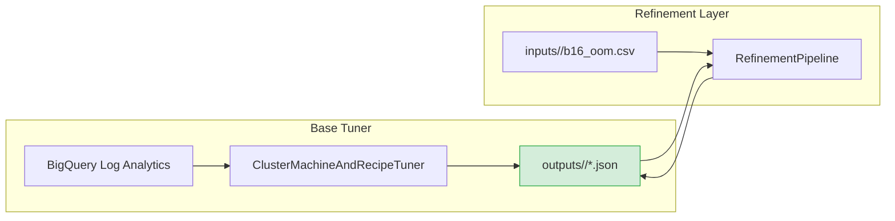
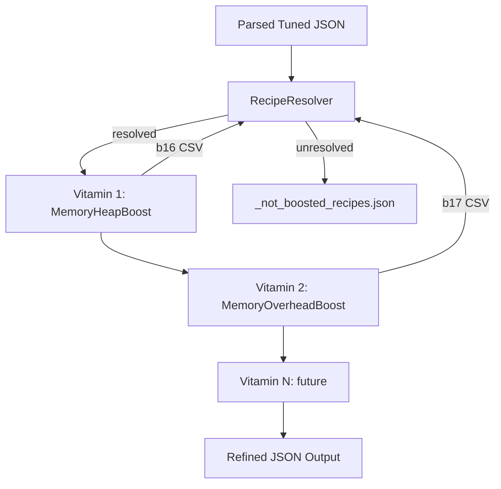
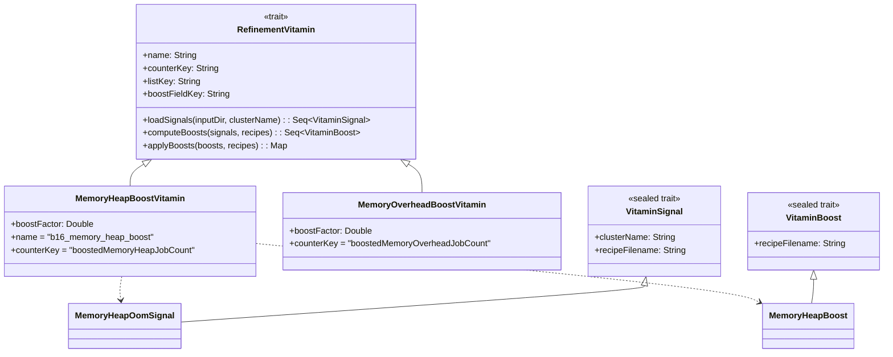

# Cluster Tuning Refinement

Post-tuning refinement layer that reads the JSON configs produced by `ClusterMachineAndRecipeTuner` and applies targeted "vitamin" boosts based on diagnostic SQL outputs (CSVs).

## Overview

The base tuner generates optimal Spark configurations per cluster. However, some jobs may still fail at runtime (e.g. OOM, container kills). The refinement app detects these failures from diagnostic log analytics queries and boosts the affected Spark settings.



The refinement app **overwrites the original tuned JSONs in-place** rather than creating a separate output directory. This keeps a single source of truth for downstream consumers.

## Vitamin Pipeline

Each vitamin is a modular diagnostic that:
1. **Loads** signals from a CSV (e.g. `b16_oom_job_driver_exceptions.csv`) — including rows with empty `recipe_filename`
2. **Resolves** missing recipe names via `RecipeResolver` (see below)
3. **Computes** boosts (e.g. `spark.executor.memory: 8g -> 12g`)
4. **Applies** boosts to recipe configs, adding tracking fields
5. **Reports** unresolved signals to `_not_boosted_recipes.json`

Vitamins are chained sequentially — each vitamin's output feeds the next:



## Recipe Resolution

Diagnostic CSVs sometimes have empty `recipe_filename` fields (the log analytics query couldn't join the job to its recipe). `RecipeResolver` attempts two strategies before marking an entry as unresolved:

**Strategy 1 — Sibling lookup:** Find another CSV row with the same job prefix (after stripping the `-YYYYMMDD-HHMM` date suffix) that has a known `recipe_filename`.

```
etl-m-dwh-d-otros-bienes-po-update-20260410-0517  →  (empty recipe)
etl-m-dwh-d-otros-bienes-po-update-20260409-0514  →  _ETL_m_DWH_D_OTROS_BIENES_PO_UPDATE.json
                                                      ↑ same prefix — use this recipe
```

**Strategy 2 — Job-id derivation:** Strip date suffix, replace `-` with `_`, uppercase, and match case-insensitively against recipes in the cluster's `recipeSparkConf`.

```
etl-m-dq3-ods-f-gr-garantia-20260411-0438
  → strip suffix  → etl-m-dq3-ods-f-gr-garantia
  → replace -→_   → etl_m_dq3_ods_f_gr_garantia
  → uppercase     → ETL_M_DQ3_ODS_F_GR_GARANTIA
  → matches       → _ETL_m_DQ3_ODS_F_GR_GARANTIA.json
```

## Unresolved Report

Signals that cannot be matched to any recipe produce `_not_boosted_recipes.json` in the output directory:

```json
{
  "b16_memory_heap_boost": {
    "csv_source": "inputs/2025_12_20/b16_oom_job_driver_exceptions.csv",
    "unresolved_count": 1,
    "entries": [
      {
        "job_id": "unknown-job-20260411-0438",
        "cluster_name": "cluster-wf-dmr-load-t-03-25-0325",
        "raw_recipe_filename": "",
        "latest_driver_log_ts": "2026-04-11T02:59:10Z",
        "latest_driver_message": "OOM"
      }
    ]
  }
}
```

This file is grouped by vitamin name, with the full CSV source path and all unmatched entries. Future vitamins (b17, b18, etc.) will add their own sections.

## Available Vitamins

| Vitamin | CSV Source | Spark Property | Trigger | Status |
|---------|-----------|---------------|---------|--------|
| `MemoryHeapBoostVitamin` | `b16_oom_job_driver_exceptions.csv` | `spark.executor.memory` | `java.lang.OutOfMemoryError: Java heap space` | Active |
| `MemoryOverheadBoostVitamin` | `b17` (future) | `spark.executor.memoryOverhead` | Container killed (off-heap) | Planned |
| `GCPressureBoostVitamin` | `b19` (future) | `spark.executor.memory` + GC opts | GC time > 10% of task time | Planned |
| `ShuffleSpillBoostVitamin` | `b18` (future) | `spark.sql.shuffle.partitions` | Excessive shuffle spill to disk | Planned |
| `BroadcastTimeoutBoostVitamin` | `b20` (future) | `spark.sql.broadcastTimeout` | BroadcastExchangeExec timeout | Planned |

## Output Changes

### Cluster-level: boost counters

Added to `clusterConf` — one counter per vitamin type:

```json
"clusterConf": {
  "cluster-wf-dmr-load-t-02-15-0215": {
    "num_workers": 10,
    "worker_machine_type": "n2d-highcpu-48",
    ...
    "boostedMemoryHeapJobCount": 1,
    "boostedMemoryHeapJobList": ["_ETL_m_DQ3_ODS_F_PM_PROPUESTAS.json"],
    "boostedMemoryOverheadJobCount": 0,
    "boostedMemoryOverheadJobList": []
  }
}
```

### Recipe-level: boost factor

Added per affected recipe alongside `parallelizationFactor`:

```json
"_ETL_m_DQ3_ODS_F_PM_PROPUESTAS.json": {
  "parallelizationFactor": 5,
  "appliedMemoryHeapBoostFactor": 1.5,
  "sparkOptsMap": {
    "spark.executor.memory": "12g",
    ...
  }
}
```

## CLI Usage

```bash
# Basic: refine with default heap boost factor (1.5x)
--referenceTuningDate=2025_12_20

# Custom heap boost factor
--referenceTuningDate=2025_12_20 --memoryHeapBoostFactor=2.0

# Future: with memory overhead boost
--referenceTuningDate=2025_12_20 --memoryHeapBoostFactor=1.5 --memoryOverheadBoostFactor=1.5
```

Run from IntelliJ: set main class to `com.db.serna.orchestration.cluster_tuning.refinement.ClusterMachineAndRecipeTunerRefinement` with program arguments.

## Adding a New Vitamin

1. Define signal and boost case classes extending `VitaminSignal` and `VitaminBoost`
2. Implement `RefinementVitamin` trait with `name`, `counterKey`, `listKey`, `boostFieldKey`
3. Register in `buildVitaminPipeline()` in `ClusterMachineAndRecipeTunerRefinement`
4. Add CLI option in `RefinementConf` if configurable
5. Add tests in a new spec or extend `RefinementVitaminsSpec`



## File Layout

```
refinement/
  ClusterMachineAndRecipeTunerRefinement.scala   # Main app + Scallop CLI
  RefinementVitamins.scala                        # Trait + signals + boosts + pipeline
  SimpleJsonParser.scala                          # JSON reader for tuned configs
  _REFINEMENT.md                                  # This file
```
